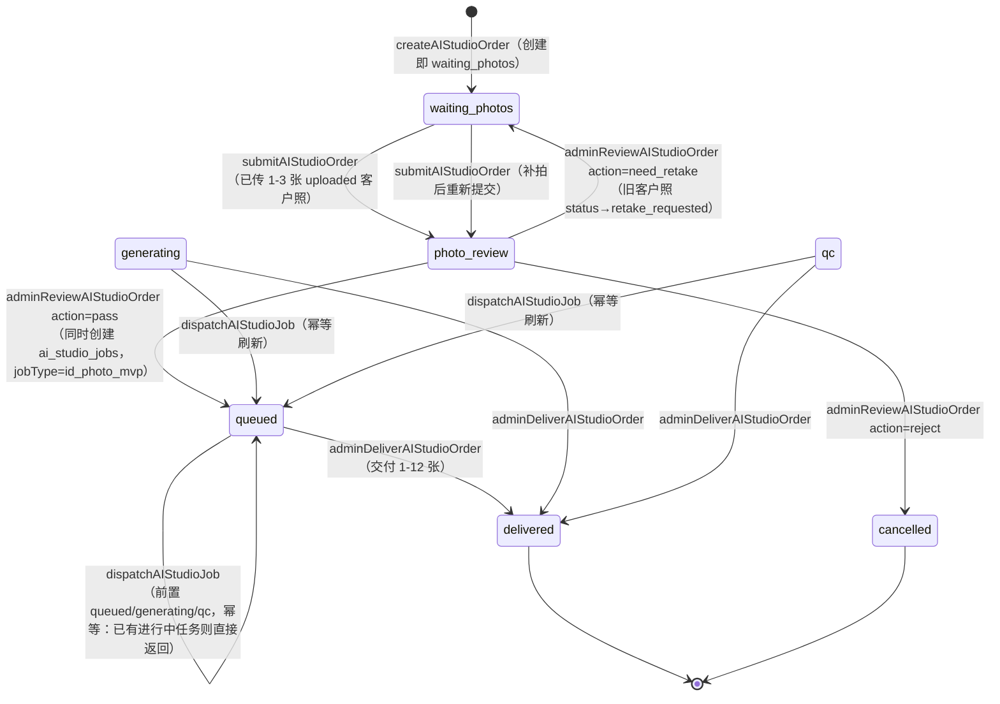
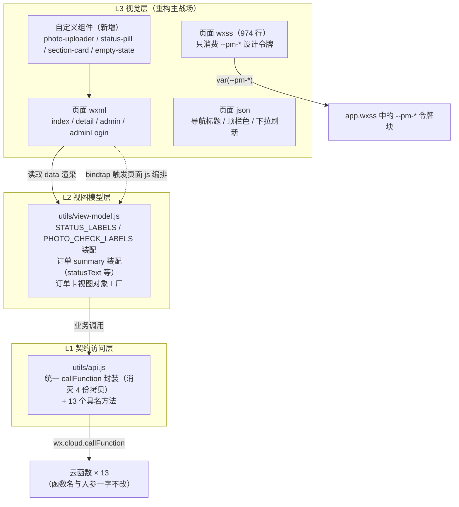
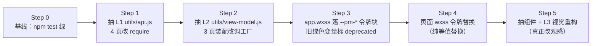
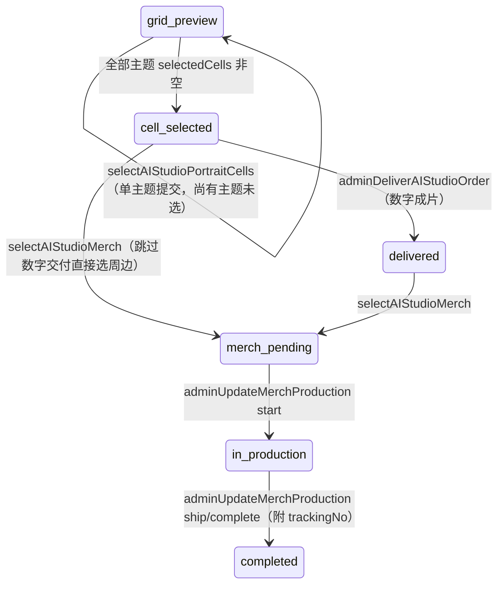

# 浅焦映像 · 前端视觉重构设计汇报

> 版本：v1.1（2026-08-16）｜适用仓库：本仓库 main 分支
> 用途：在不更改任何本地契约接口、后端云函数与数据库的前提下，指导前端视觉效果的分层重构。
> 配套：重构操作按第五章执行；每一步以 `npm test`（tests/ai-studio/validate-ai-studio.js）为验收安全网。
> v1.1 说明：第一至五章写就后项目新增了影楼商业闭环（多主题套系 / AI 视觉推荐 / 周边衍生品 / 场景模拟页 / 印刷制作稿 / 网站独立版），原章节契约仍然有效，全部增量见文末**第六章 v1.1 增补**；重构顺序与令牌方案不变，范围扩大后以第六章 6.5 的更新清单为准。

**目录**

- 一、汇报边界与重构总则（冻结项 / 可更改项总表）
- 二、契约接口基线（13 个云函数契约卡 + 状态机 + 集合清单 + 调用约束）
- 三、前端模块单独清单（4 页面文件/data/方法映射/区块树/色值 + app.wxss + 重复代码）
- 四、横切解耦设计（L1/L2/L3 三层架构 + --pm-* 设计令牌 + 组件抽取 + 横切关注点）
- 五、视觉重构操作指引（冻结文案对照表 + 逐页改造清单 + 验收清单 + 风险表）

# 一、汇报边界与重构总则

## 1.1 汇报目的

为「浅焦映像」小程序的**前端视觉重构**提供一份可直接执行的工程设计汇报：把本地契约接口、每个模块的功能职责、横切解耦点全部列清，前端单独成章；重构者只改表现层，即可安全地重塑全部视觉效果，而接口、后端与数据库分毫不动。

## 1.2 冻结项与可更改项总表

| 类别 | 内容 | 状态 |
| --- | --- | --- |
| 云函数接口 | 13 个 `*AIStudio*` 函数的函数名、入参、返回结构、错误码、调用时序（第二章） | ❄️ 冻结 |
| 数据库 | 7 个 `ai_studio_*` 集合的集合名、字段、状态枚举、状态机（2.3 / 2.4） | ❄️ 冻结 |
| 云存储约定 | cloudPath 规范 `ai-studio/{orderId}/customer|customer-retake|delivery/…`、fileID `cloud://` 前缀（2.5） | ❄️ 冻结 |
| 共享配置 | `utils/ai-studio-config.js` 的 6 个导出常量及其数量/价格断言（5.1.5） | ❄️ 冻结 |
| 测试断言 | `tests/ai-studio/validate-ai-studio.js` 全部 wxml/js/config 字符串断言（5.1 对照表） | ❄️ 冻结 |
| 跨页运行时契约 | `app.globalData.aiStudioOrderQuery` / `aiStudioAdminPassword` 字段名与读写时机（4.4-6） | ❄️ 冻结 |
| 页面 js 行为 | 各方法调用的云函数与入参（第三章各页"方法→云函数映射表"） | ❄️ 冻结 |
| wxml 结构与 class | 区块布局、class 命名（冻结文案与断言子串除外，见 5.1） | ✅ 可改 |
| wxss | 全部样式（推荐收敛到 `--pm-*` 令牌，见 4.2） | ✅ 可改 |
| 页面 json | 标题措辞、顶栏/窗口底色（需与令牌手工同步） | ✅ 可改 |
| js 视图层组织 | 新增 `utils/api.js`、`utils/view-model.js` 等纯前端模块；重复帮助函数收敛（4.1） | ✅ 可改（行为不变） |

## 1.3 重构总则

1. **先立骨架，再动皮肤**：按 4.1.5 的 Step 1-2 先抽 L1 契约访问层与 L2 视图模型层（纯代码移动，每步 `npm test` 绿），Step 3-4 落设计令牌做等值替换，最后 Step 5 才真正改视觉。任何一步都可独立提交、独立回滚。
2. **测试是安全网，不是障碍**：`npm test` 的断言即冻结边界（5.1 全量对照表）。改 wxml 前先跑测试确认绿，改后立即再跑。
3. **视觉与行为双轨**：表现层（wxml/wxss/json）自由创作；行为层（云函数调用、状态字面量、globalData 交接）只搬不改。
4. **一处定义，四处生效**：颜色只出现在 `--pm-*` 令牌定义处；状态文案映射只出现在 view-model；`wx.cloud.callFunction` 只出现在 api.js。

# 二、契约接口基线（冻结项）

> 本章面向前端视觉重构者，界定「后端已冻结、前端必须原样对齐」的接口契约边界。所有内容逐字核对自 `cloudfunctions/<函数名>/index.js` 源码（每函数单文件）。视觉重构只改 WXML/WXSS 与页面交互表现，**不得改动本章列出的任何入参、返回结构与调用时序**。

通用返回约定（全部 13 个函数一致）：

- 成功：`{ success: true, ...业务字段 }`（`getAIStudioRuntimeConfig` 与 `callAIStudioCustomerService` 在异常时也返回 `success: true` 的降级结构，永不返回 `success: false`）。
- 失败：`{ success: false, code, message }`，`code` 为错误枚举，`message` 为可直接展示给用户的中文文案。

通用鉴权约定：

- 用户端函数：依赖云函数调用上下文 `OPENID`（`cloud.getWXContext()`），无 OPENID 返回 `UNAUTHENTICATED`。
- 管理端函数：双重校验，二者同时满足才放行，否则 `FORBIDDEN`：
  - `isAdmin(OPENID)`：OPENID 必须在环境变量 `AI_STUDIO_ADMIN_OPENIDS`（逗号分隔白名单）中；
  - `isAdminPassword(event.adminPassword)`：入参 `adminPassword`（string，trim 后）严格等于环境变量 `AI_STUDIO_ADMIN_PASSWORD`；**该环境变量为空字符串时恒返回 false，即未配置密码时管理接口全封死**。

## 2.1 接口总览表

| # | 函数名 | 调用方 | 鉴权方式 | 读写集合 |
|---|--------|--------|----------|----------|
| 1 | `createAIStudioOrder` | 用户端 index（下单） | OPENID（本人） | 写 `ai_studio_orders`、`ai_studio_audit_logs` |
| 2 | `uploadAIStudioPhoto` | 用户端 index（首传）/ detail（补拍） | OPENID（本人订单） | 写 `ai_studio_files`，改 `ai_studio_orders`，写 `ai_studio_audit_logs` |
| 3 | `submitAIStudioOrder` | 用户端 index / detail（补拍后重提） | OPENID（本人订单） | 改 `ai_studio_orders`，写 `ai_studio_audit_logs`；只读 `ai_studio_files`（计数） |
| 4 | `listMyAIStudioOrders` | 用户端 index（我的订单） | OPENID（本人） | 读 `ai_studio_orders` |
| 5 | `getAIStudioOrderDetail` | 用户端 detail | OPENID（本人订单） | 读 `ai_studio_orders`、`ai_studio_files` |
| 6 | `queryAIStudioOrder` | 用户端 index（免登录查询入口） | 无登录；三元组（订单号+手机号+SHA256 查询密码） | 读 `ai_studio_orders`、`ai_studio_files` |
| 7 | `adminListAIStudioOrders` | 管理端 admin（adminLogin 页用作登录探针） | OPENID 白名单 + adminPassword | 读 `ai_studio_orders`、`ai_studio_files` |
| 8 | `adminReviewAIStudioOrder` | 管理端 admin | OPENID 白名单 + adminPassword | 改 `ai_studio_orders`，改/写 `ai_studio_files`、`ai_studio_jobs`，写 `ai_studio_audit_logs` |
| 9 | `adminDeliverAIStudioOrder` | 管理端 admin | OPENID 白名单 + adminPassword | 写 `ai_studio_files`，改 `ai_studio_orders`、`ai_studio_jobs`，写 `ai_studio_audit_logs` |
| 10 | `getAIStudioRuntimeConfig` | 内部预留（当前无前端调用点，公开可读） | 无鉴权 | 读 `ai_studio_model_settings`、`ai_studio_prompt_templates`、`ai_studio_routes`（空集合回退内置默认） |
| 11 | `adminUpsertAIStudioRuntimeConfig` | 管理端预留（admin 密码） | OPENID 白名单 + adminPassword | 写 `ai_studio_model_settings`、`ai_studio_prompt_templates`、`ai_studio_routes` |
| 12 | `dispatchAIStudioJob` | 内部预留（本人订单，或 admin 携 adminPassword 代发） | OPENID；访问他人订单需白名单 + adminPassword | 读 `ai_studio_routes`、`ai_studio_model_settings`，写 `ai_studio_jobs`，改 `ai_studio_orders`，写 `ai_studio_audit_logs` |
| 13 | `callAIStudioCustomerService` | 内部预留（当前无前端调用点，登录用户） | OPENID；带 orderId 时校验本人订单 | 读 `ai_studio_model_settings`、`ai_studio_prompt_templates`，写 `ai_studio_audit_logs`（失败静默） |

## 2.2 逐函数契约卡

### 2.2.1 createAIStudioOrder（创建订单）

**入参字段**

| 字段 | 类型 | 校验规则 |
|------|------|----------|
| `productId` | string | 必须命中白名单 `id_photo_9_9`（3.9 证件照体验版，deliveryCount=1，productionLine=auto）/ `resume_photo_29_9`（29.9 简历形象照，deliveryCount=3，productionLine=semi_auto） |
| `styleId` | string | 必须命中白名单 `ID-01` / `ID-02` / `ID-03`（id_photo，auto）/ `BZ-01`（business，semi_auto） |
| `contactPhone` | string | trim + 去全部空白后须匹配 `/^1\d{10}$/`（11 位大陆手机号），截断 20 字符内校验 |
| `queryPassword` | string | 截断 32 字符后长度 ≥ 6 |
| `authorization` | object | `isSelfOrAuthorized`、`isAdult`、`agreesProduction` 三者必须全为真值 |
| `usage` | string | 可选，trim 截断 80 |
| `backgroundColor` | string | 可选，trim 截断 20 |
| `clothingOption` | string | 可选，trim 截断 40 |
| `spec` | string | 可选，trim 截断 40 |
| `customerNote` | string | 可选，trim 截断 300 |

**返回结构**

- 成功：`{ success: true, order: { orderId, order_status: 'waiting_photos', photo_check: 'unchecked' } }`，其中 `orderId` 格式为 `AIStudio-{Date.now()}-{6位36进制随机串}`。
- 失败 code 枚举：

| code | message | 触发条件 |
|------|---------|----------|
| `UNAUTHENTICATED` | 请先登录后再下单 | 无 OPENID |
| `VALIDATION_ERROR` | 请选择有效套餐 / 请选择有效风格 / 请填写用于查询订单的手机号 / 查询密码至少 6 位 | 对应字段校验失败 |
| `AUTHORIZATION_REQUIRED` | 请先确认本人/成年人授权 | authorization 三项非全真 |
| `INTERNAL_ERROR` | 创建订单失败，请稍后重试 | 异常兜底 |

**鉴权**：OPENID 必须存在。
**读写**：`ai_studio_orders` add（字段全集见 2.4）；`ai_studio_audit_logs` add（action=`create_order`，payload 含 productId、styleId）。
**业务规则**：查询密码在服务端做 SHA256 hex 后落库为 `queryPasswordHash`，原文不落库；套餐价与交付张数由服务端常量决定，前端传入无效。

### 2.2.2 uploadAIStudioPhoto（登记客户照片）

**入参字段**

| 字段 | 类型 | 校验规则 |
|------|------|----------|
| `orderId` | string | 必填，trim 截断 80；须为本人（orderId + _openid）订单 |
| `fileID`（兼容 `fileId`） | string | 必填，trim 截断 300，**必须以 `cloud://` 开头** |
| `fileName` | string | 可选，trim 截断 120 |
| `size` | number | 非有限数或负数时置 0 |
| `mimeType` | string | 可选，trim 截断 60 |

**返回结构**

- 成功：`{ success: true, fileId, referencePhotoCount }`（fileId 为 `ai_studio_files` 记录 _id，referencePhotoCount 为累计数）。
- 失败 code 枚举：

| code | message | 触发条件 |
|------|---------|----------|
| `UNAUTHENTICATED` | 请先登录后再上传 | 无 OPENID |
| `VALIDATION_ERROR` | 上传文件参数无效 | orderId 为空或 fileID 不以 cloud:// 开头 |
| `NOT_FOUND` | 订单不存在或无权访问 | 非本人订单 |
| `INVALID_STATUS` | 当前订单状态不允许继续上传照片 | order_status 不在 `waiting_photos` / `photo_review` |
| `PHOTO_LIMIT_EXCEEDED` | 最多上传 3 张参考照片 | 状态为 uploaded 的 customer_photo 已达 MAX_PHOTOS=3 |
| `INTERNAL_ERROR` | 登记照片失败，请稍后重试 | 异常兜底 |

**鉴权**：OPENID + 本人订单。
**读写**：`ai_studio_files` add（fileType=`customer_photo`，status=`uploaded`）；`ai_studio_orders` update（reference_photo_count、updatedAt）；`ai_studio_audit_logs`（action=`upload_customer_photo`）。
**业务规则上限**：`MAX_PHOTOS = 3`，按「orderId + _openid + fileType=customer_photo + status=uploaded」计数。

### 2.2.3 submitAIStudioOrder（提交审核）

**入参字段**

| 字段 | 类型 | 校验规则 |
|------|------|----------|
| `orderId` | string | 必填，trim 截断 80；须为本人订单 |

**返回结构**

- 成功：`{ success: true, order: { orderId, order_status: 'photo_review', photo_check: 'unchecked', reference_photo_count } }`。
- 失败 code 枚举：

| code | message | 触发条件 |
|------|---------|----------|
| `UNAUTHENTICATED` | 请先登录后再提交 | 无 OPENID |
| `VALIDATION_ERROR` | 订单号无效 | orderId 为空 |
| `NOT_FOUND` | 订单不存在或无权访问 | 非本人订单 |
| `AUTHORIZATION_REQUIRED` | 请先确认本人/成年人授权 | 订单 `adult_identity_authorization !== 'confirmed'` |
| `PHOTO_REQUIRED` | 请至少上传 1 张正脸照片 | uploaded 状态客户照 < 1 |
| `PHOTO_LIMIT_EXCEEDED` | 最多上传 3 张参考照片 | uploaded 状态客户照 > 3 |
| `INTERNAL_ERROR` | 提交订单失败，请稍后重试 | 异常兜底 |

**鉴权**：OPENID + 本人订单。
**读写**：`ai_studio_orders` update（order_status=`photo_review`、photo_check=`unchecked`、reference_photo_count、submittedAt、updatedAt）；`ai_studio_audit_logs`（action=`submit_order`）；只读 `ai_studio_files` 计数。
**业务规则**：照片数合法区间 [1, 3]；每次提交都会把 photo_check 重置为 `unchecked`（补拍重提同理）。

### 2.2.4 listMyAIStudioOrders（我的订单列表）

**入参字段**

| 字段 | 类型 | 校验规则 |
|------|------|----------|
| `page` | number | 非负整数，否则归 0 |
| `pageSize` | number | 正整数，否则默认 10；**上限 30（Math.min）** |

**返回结构**

- 成功：`{ success: true, data: [...], pagination: { page, pageSize, total, hasMore } }`，`hasMore = (page+1)*pageSize < total`。
- 列表项（summary）字段：`orderId`、`productName`、`styleName`、`price`、`order_status`、`photo_check`、`reference_photo_count`、`delivery_file_count`、`reviewNote`、`createdAt`、`updatedAt`。
- 失败：`UNAUTHENTICATED`（请先登录后再查看订单）/ `INTERNAL_ERROR`（获取订单失败，请稍后重试）。

**鉴权**：OPENID（按 `_openid` 过滤）。
**读写**：只读 `ai_studio_orders`（createdAt 倒序，skip = page*pageSize）。

### 2.2.5 getAIStudioOrderDetail（订单详情-登录态）

**入参字段**

| 字段 | 类型 | 校验规则 |
|------|------|----------|
| `orderId` | string | 必填，trim 截断 80；须为本人订单 |

**返回结构**

- 成功：`{ success: true, order, files }`。`order` 为订单文档原样返回（含 `_openid`、`queryPasswordHash` 等全字段，**不做剥离**，但仅限本人可见）；`files` 为 `toPublicFile` 映射：`fileId`、`fileType`、`fileID`、`fileName`、`size`、`status`、`createdAt`（createdAt 升序）。
- 失败：`UNAUTHENTICATED`（请先登录后再查看订单）/ `VALIDATION_ERROR`（订单号无效）/ `NOT_FOUND`（订单不存在或无权访问）/ `INTERNAL_ERROR`（获取订单详情失败，请稍后重试）。

**鉴权**：OPENID + 本人订单。
**读写**：只读 `ai_studio_orders`、`ai_studio_files`。

### 2.2.6 queryAIStudioOrder（订单查询-免登录三元组）

**入参字段**

| 字段 | 类型 | 校验规则 |
|------|------|----------|
| `orderId` | string | 必填，trim 截断 80 |
| `contactPhone` | string | 必填，去空白后须匹配 `/^1\d{10}$/` |
| `queryPassword` | string | 必填，截断 32 后长度 ≥ 6 |

**返回结构**

- 成功：`{ success: true, order, files }`。`order` 经 `sanitizeOrder` **剥离 `queryPasswordHash` 后**返回其余全字段；`files` 与 2.2.5 的 `toPublicFile` 结构一致（createdAt 升序，按订单属主 _openid 查询）。
- 失败：`VALIDATION_ERROR`（请填写订单号、手机号和查询密码）/ `NOT_FOUND`（订单不存在或查询信息不匹配）/ `INTERNAL_ERROR`（查询订单失败，请稍后重试）。

**鉴权**：免登录。三元组 `{ orderId, contactPhone, queryPasswordHash(SHA256) }` 联合 where 匹配，任一不符即 `NOT_FOUND`（不区分「不存在」与「不匹配」）。
**读写**：只读 `ai_studio_orders`、`ai_studio_files`。
**业务规则**：这是唯一无 OPENID 依赖的订单读接口；前端在 `pages/aiStudio/index.js` 查询成功后把三元组明文存入 `app.globalData.aiStudioOrderQuery` 并跳转 detail（见 2.5）。

### 2.2.7 adminListAIStudioOrders（管理端订单看板）

**入参字段**

| 字段 | 类型 | 校验规则 |
|------|------|----------|
| `adminPassword` | string | 必填，trim 后须等于 `AI_STUDIO_ADMIN_PASSWORD`（空串环境变量恒拒绝） |
| `page` | number | 非负整数，否则归 0 |
| `pageSize` | number | 正整数，默认 10，**上限 30** |
| `status` | string | 可选，trim 截断 40；非空时按 `order_status` 精确过滤，空串查全部 |

**返回结构**

- 成功：`{ success: true, data: [...], pagination: { page, pageSize, total, hasMore } }`。列表项为订单文档全字段展开（`...order`，含 `queryPasswordHash`）追加 `files` 数组（本页订单的 `ai_studio_files` 聚合，fileId/fileType/fileID/fileName/size/status/createdAt，createdAt 升序，用 `_.in(orderIds)` 一次查回）。
- 失败：`FORBIDDEN`（无权访问订单管理）/ `INTERNAL_ERROR`（获取影楼订单看板失败）。

**鉴权**：OPENID 白名单 + adminPassword 双重校验。
**读写**：只读 `ai_studio_orders`、`ai_studio_files`。
**前端既定用法（冻结）**：adminLogin 页以 `{ status: 'photo_review', page: 0, pageSize: 1, adminPassword }` 作为登录探针验证密码。

### 2.2.8 adminReviewAIStudioOrder（管理端审核）

**入参字段**

| 字段 | 类型 | 校验规则 |
|------|------|----------|
| `adminPassword` | string | 必填，同上 |
| `orderId` | string | 必填，trim 截断 80 |
| `action` | string | 必填，trim 截断 30，枚举 `pass` / `need_retake` / `reject` |
| `reason` | string | 可选，trim 截断 300 |

**返回结构**

- 成功：`{ success: true, order: { orderId, order_status, photo_check, reviewNote } }`。
- 失败：`FORBIDDEN`（无权审核订单）/ `VALIDATION_ERROR`（订单号无效 / 审核动作无效）/ `NOT_FOUND`（订单不存在）/ `INTERNAL_ERROR`（审核订单失败）。

**鉴权**：OPENID 白名单 + adminPassword。
**读写与副作用（按 action）**：

- `pass`：`ai_studio_orders` update（order_status=`queued`、photo_check=`passed`、reviewNote=reason（可为空串）、reviewedAt、updatedAt）；`ai_studio_jobs` add（orderId、_openid、jobType=`id_photo_mvp`、status=`queued`、productId、styleId、createdAt、updatedAt）。
- `need_retake`：`ai_studio_orders` update（order_status=`waiting_photos`、photo_check=`need_retake`、reviewNote=reason 或默认「照片不符合制作要求，请重新上传清晰正脸照。」）；`ai_studio_files` 批量 update（条件 orderId + fileType=customer_photo + status=uploaded → status=`retake_requested`）。
- `reject`：`ai_studio_orders` update（order_status=`cancelled`、photo_check=`rejected`、reviewNote=reason 或默认「照片或用途不符合制作规则。」）。
- 三种 action 均写 `ai_studio_audit_logs`，action 名为 `admin_review_pass` / `admin_review_need_retake` / `admin_review_reject`，payload=`{ reason }`。

**业务规则**：函数不校验订单当前状态，任何状态均可被审核改写（管理端 UI 自律）。

### 2.2.9 adminDeliverAIStudioOrder（管理端交付）

**入参字段**

| 字段 | 类型 | 校验规则 |
|------|------|----------|
| `adminPassword` | string | 必填，同上 |
| `orderId` | string | 必填，trim 截断 80 |
| `deliveryFiles` | Array | 必填数组，长度 1–12；每项 `fileID`（兼容 `fileId`，截断 300，**必须 cloud:// 开头**）、`fileName`（截断 120）、`size`（非法置 0）、`mimeType`（截断 60） |
| `deliveryNote` | string | 可选，trim 截断 300 |

**返回结构**

- 成功：`{ success: true, order: { orderId, order_status: 'delivered', delivery_file_count } }`。
- 失败：`FORBIDDEN`（无权交付订单）/ `VALIDATION_ERROR`（订单号无效 / 请至少上传 1 张交付图 / 单次最多登记 12 张交付图 / 交付图文件参数无效）/ `NOT_FOUND`（订单不存在）/ `INTERNAL_ERROR`（交付订单失败）。

**鉴权**：OPENID 白名单 + adminPassword。
**读写**：`ai_studio_files` 逐条 add（fileType=`delivery`、status=`delivered`、_openid 取订单属主）；`ai_studio_orders` update（order_status=`delivered`、delivery_file_count、deliveryNote、deliveredAt、updatedAt）；`ai_studio_jobs` update（status=`delivered`，失败静默忽略）；`ai_studio_audit_logs`（action=`admin_deliver_order`，payload 含 deliveryFileCount、deliveryNote）。
**业务规则上限**：单次交付 1–12 张；**不校验订单前置状态**，任何状态均可直接交付（含已 delivered 的覆盖式追加）。

### 2.2.10 getAIStudioRuntimeConfig（读取运行配置）

**入参**：无（忽略一切入参）。
**鉴权**：无（公开读）。
**读写**：只读 `ai_studio_model_settings` / `ai_studio_prompt_templates` / `ai_studio_routes`（各取 `enabled: true`，limit 50）。

**返回结构**

- 成功：`{ success: true, config: { modelSettings, promptTemplates, routes } }`。
- 三个集合任一为空时使用内置 `DEFAULT_CONFIG` 对应分块回退；读取异常时整体回退：`{ success: true, config: <默认配置>, message: '使用默认影楼运行配置' }`。**此函数永远 `success: true`，无失败 code。**
- 每个条目经 `stripPrivateFields` 剥离 `_id`、`_openid`、`apiKey`、`secret`、`token`、`headers`、**`content`**（prompt 正文不下发前端）。
- 内置默认要点：customer_service 场景 provider=`local_fallback`、model=`local-scripted-service`、maxTokens=600、temperature=0.4、publicName=影楼客服助手；image_generation 场景 enabled=false、provider=`manual`、model=`manual-human-qc`、workflowId=`id_photo_mvp_manual_v1`、requiresHumanQC=true；promptKey=`ai_studio_service_v1` v1；路由 `id_photo_auto_v1` 覆盖两套餐四风格、processingMode=`semi_auto`。

### 2.2.11 adminUpsertAIStudioRuntimeConfig（保存运行配置）

**入参字段**

| 字段 | 类型 | 校验规则 |
|------|------|----------|
| `adminPassword` | string | 必填，双重校验同上 |
| `modelSettings` | Array | 可选；每项归一化：scene（截 60，作为 upsert 键）、enabled（默认 true）、provider（截 60，默认 `local_fallback`）、model（截 120，默认 `local-scripted-service`）、fallbackModel（截 120）、workflowId（截 120）、maxTokens（clamp 100–2000，默认 600）、temperature（clamp 0–2，默认 0.4）、requiresHumanQC（默认 true）、outputType（截 40）、publicName（截 80） |
| `promptTemplates` | Array | 可选；每项：promptKey（截 80，upsert 键）、scene（截 60）、version（clamp 1–999，默认 1）、enabled（默认 true）、content（截 3000） |
| `routes` | Array | 可选；每项：routeKey（截 80，upsert 键）、enabled（默认 true）、productIds（每项截 80，最多 20 项）、styleIds（每项截 40，最多 30 项）、customerServiceScene（截 60，默认 `customer_service`）、imageGenerationScene（截 60，默认 `image_generation`）、processingMode（截 40，默认 `semi_auto`） |

**返回结构**

- 成功：`{ success: true, updated: <条目总数>, message: 'AI 影楼运行配置已保存' }`。
- 失败：`FORBIDDEN`（无权配置模型）/ `INTERNAL_ERROR`（保存 AI 影楼运行配置失败；条目缺 upsert 键时 throw 亦落入此 code）。

**鉴权**：OPENID 白名单 + adminPassword。
**读写**：按键（scene / promptKey / routeKey）对三个集合 upsert——已有则 update（附 updatedBy=OPENID、updatedAt），无则 add（附 createdBy=OPENID、createdAt）。

### 2.2.12 dispatchAIStudioJob（派发出图任务）

**入参字段**

| 字段 | 类型 | 校验规则 |
|------|------|----------|
| `orderId` | string | 必填，trim 截断 80 |
| `adminPassword` | string | 可选；仅当 orderId 非本人订单时，管理员凭白名单 + 此密码代发 |

**返回结构**

- 成功（新建）：`{ success: true, job: { jobId, ...job } }`。
- 成功（幂等命中）：`{ success: true, job: <已存在任务文档>, message: '已有进行中的出图任务' }`。
- 失败：`UNAUTHENTICATED`（请先登录）/ `VALIDATION_ERROR`（订单号无效）/ `NOT_FOUND`（订单不存在或无权访问）/ `INVALID_STATUS`（当前订单状态不需要派发出图任务）/ `INTERNAL_ERROR`（派发出图任务失败）。

**鉴权**：OPENID 必须存在；订单可见性 = 本人订单，或（白名单 + adminPassword）任意订单。
**读写与规则**：

- 状态前置：order_status ∈ `queued` / `generating` / `qc`，否则 `INVALID_STATUS`。
- 幂等：已存在 status ∈ `queued`/`generating`/`qc` 的 `ai_studio_jobs` 记录时直接返回该任务，不新建。
- 路由匹配：读 `ai_studio_routes`（enabled=true，limit 50），productIds/styleIds 为空数组视为通配，未命中回退 `{ routeKey: 'id_photo_auto_v1', imageGenerationScene: 'image_generation', processingMode: 'semi_auto' }`；再读 `ai_studio_model_settings`（对应 scene 且 enabled），未命中回退 manual。
- 新建 job 字段：orderId、_openid、jobType=`ai_studio_image_generation`、status=`queued`（当前分支恒为 queued）、dispatchMode（enabled ? `configured_provider` : `manual_required`）、provider、model、workflowId（默认 `id_photo_mvp_manual_v1`）、routeKey、productId、styleId、requiresHumanQC、createdAt、updatedAt。
- 同时 update 订单 order_status=`queued`、updatedAt；写 `ai_studio_audit_logs`（action=`dispatch_image_job`，payload 含 jobId、provider、workflowId、dispatchMode）。

### 2.2.13 callAIStudioCustomerService（AI 客服问答）

**入参字段**

| 字段 | 类型 | 校验规则 |
|------|------|----------|
| `message`（兼容 `question`） | string | 必填，trim **截断 500**；空则 `VALIDATION_ERROR` |
| `orderId` | string | 可选，截 80；若携带则必须是本人订单，否则 `FORBIDDEN` |

**返回结构**

- 成功：`{ success: true, response, provider, model }`。provider 为 `local_fallback` 时 model 恒为 `local-scripted-service`。
- 异常兜底（catch）：`{ success: true, response: <本地话术>, provider: 'local_fallback', message: '已使用本地客服话术' }`。
- 失败：`UNAUTHENTICATED`（请先登录）/ `VALIDATION_ERROR`（请输入咨询内容）/ `FORBIDDEN`（无权咨询该订单）。

**鉴权**：OPENID；带 orderId 时校验属主。
**读写**：读 `ai_studio_model_settings`（scene=customer_service，enabled）、`ai_studio_prompt_templates`（promptKey=`ai_studio_service_v1`，enabled），均带内置默认回退；写 `ai_studio_audit_logs`（action=`customer_service_message`，payload 含 provider、messageLength，写入失败静默忽略）。
**业务规则**：仅当配置 enabled 且 provider=`openai_compatible` 且环境变量 `AI_STUDIO_TEXT_API_URL`、`AI_STUDIO_TEXT_API_KEY` 齐备时才外呼（强制 https、8 秒超时）；**外呼回复内容截断 1200 字**；外呼失败自动回退本地关键词话术，前端永远拿到可用 response。

## 2.3 订单状态机与 photo_check 流转

`ai_studio_orders.order_status` 状态机（每个流转标注触发函数与 action）：



状态机备注（均以源码为准）：

- `generating`、`qc` 两个状态在当前 13 个函数中**没有任何写入路径**（预留态，供人工/后续流水线使用），但 `dispatchAIStudioJob` 的前置校验显式放行 `['queued', 'generating', 'qc']`。
- `adminDeliverAIStudioOrder` 不做前置状态校验：从任何 order_status（含已 delivered / cancelled）都能直接交付并改写为 `delivered`。
- `uploadAIStudioPhoto` 只在 `waiting_photos` / `photo_review` 两个状态放行上传（补拍期 photo_review 回到 waiting_photos 后由 need_retake 流转覆盖）。

`photo_check` 枚举与写入点：

| 值 | 含义 | 写入来源 |
|----|------|----------|
| `unchecked` | 未审/重置 | createAIStudioOrder 初始值；submitAIStudioOrder 每次提交重置 |
| `passed` | 审核通过 | adminReviewAIStudioOrder action=pass |
| `need_retake` | 需补拍 | adminReviewAIStudioOrder action=need_retake |
| `rejected` | 拒绝 | adminReviewAIStudioOrder action=reject |

`ai_studio_files.status`（customer_photo）联动：`uploaded`（uploadAIStudioPhoto 写入）→ `retake_requested`（adminReview need_retake 时，对仍为 uploaded 的客户照批量改写）；delivery 文件恒为 `delivered`（adminDeliver 写入）。

## 2.4 数据库集合清单（7 个 ai_studio_* 集合）

### ai_studio_orders（订单主表）

写入方：createAIStudioOrder（add）、uploadAIStudioPhoto / submitAIStudioOrder / adminReviewAIStudioOrder / adminDeliverAIStudioOrder / dispatchAIStudioJob（update）。字段全集（create 写入 + 后续 update 增量）：

| 字段 | 写入来源 | 说明 |
|------|----------|------|
| `orderId` | create | `AIStudio-{时间戳}-{随机串}` |
| `_openid` | create | 下单人 |
| `productId` / `productName` / `price` / `deliveryCount` / `productionLine` | create | 套餐快照（服务端常量） |
| `styleId` / `styleName` | create | 风格快照 |
| `usage` / `backgroundColor` / `clothingOption` / `spec` / `customerNote` | create | 用户选项与备注 |
| `contactPhone` | create | 查询手机号 |
| `queryPasswordHash` | create | 查询密码 SHA256 hex |
| `payment_status` | create | 初始 `unpaid` |
| `order_status` | create / submit / review / deliver / dispatch | 见 2.3 状态机 |
| `photo_check` | create / submit / review | 见 2.3 |
| `adult_identity_authorization` | create | 恒 `confirmed` |
| `case_permission` | create | 初始 `unconfirmed` |
| `refund_status` | create | 初始 `none` |
| `upsell_status` | create | 初始 `not_upsold` |
| `reference_photo_count` | create / upload / submit | 客户照计数（0–3） |
| `delivery_file_count` | create / deliver | 交付图计数（1–12） |
| `authorization` | create | `{ version:'ai-studio-auth-v1', isSelfOrAuthorized, isAdult, agreesProduction, acceptedAt }` |
| `source` | create | 恒 `miniprogram` |
| `createdAt` / `updatedAt` | create 及所有 update | db.serverDate() |
| `submittedAt` | submit | 提交时间 |
| `reviewNote` / `reviewedAt` | review | 审核备注与时间 |
| `deliveryNote` / `deliveredAt` | deliver | 交付备注与时间 |

读取方：listMy / getDetail / query / adminList / review / deliver / dispatch / submit / upload。

### ai_studio_files（照片与交付文件表）

写入方：uploadAIStudioPhoto（add customer_photo）、adminDeliverAIStudioOrder（add delivery）、adminReviewAIStudioOrder（need_retake 时批量 update status）。字段：`orderId`、`_openid`、`fileType`（`customer_photo` / `delivery`）、`fileID`（cloud://）、`fileName`、`size`、`mimeType`、`status`（`uploaded` / `retake_requested` / `delivered`）、`createdAt`、`updatedAt`。读取方：getDetail / query / adminList（submit、upload 仅计数）。

### ai_studio_jobs（出图任务表）

写入方：adminReviewAIStudioOrder（pass 时 add：orderId、_openid、jobType=`id_photo_mvp`、status=`queued`、productId、styleId、createdAt、updatedAt）、dispatchAIStudioJob（add：另含 jobType=`ai_studio_image_generation`、dispatchMode、provider、model、workflowId、routeKey、requiresHumanQC）、adminDeliverAIStudioOrder（update status=`delivered`）、dispatchAIStudioJob（读幂等判断）。

### ai_studio_audit_logs（审计日志表）

写入方：createAIStudioOrder、uploadAIStudioPhoto、submitAIStudioOrder、adminReviewAIStudioOrder、adminDeliverAIStudioOrder、dispatchAIStudioJob、callAIStudioCustomerService（写入失败静默）。字段：`orderId`、`actorOpenid`、`action`、`payload`、`createdAt`。action 全集：`create_order`、`upload_customer_photo`、`submit_order`、`admin_review_pass`、`admin_review_need_retake`、`admin_review_reject`、`admin_deliver_order`、`dispatch_image_job`、`customer_service_message`。无读取方（仅人肉追溯）。

### ai_studio_model_settings（模型设置表）

写入方：adminUpsertAIStudioRuntimeConfig（按 scene upsert，附 updatedBy/updatedAt/createdBy/createdAt）。字段：`scene`（键）、`enabled`、`provider`、`model`、`fallbackModel`、`workflowId`、`maxTokens`、`temperature`、`requiresHumanQC`、`outputType`、`publicName`。读取方：getAIStudioRuntimeConfig（剥离私有字段）、dispatchAIStudioJob、callAIStudioCustomerService。

### ai_studio_prompt_templates（提示词模板表）

写入方：adminUpsertAIStudioRuntimeConfig（按 promptKey upsert）。字段：`promptKey`（键）、`scene`、`version`、`enabled`、`content`（≤3000）+ 审计四件套。读取方：getAIStudioRuntimeConfig（**content 被剥离，不下发前端**）、callAIStudioCustomerService（服务端使用）。

### ai_studio_routes（路由表）

写入方：adminUpsertAIStudioRuntimeConfig（按 routeKey upsert）。字段：`routeKey`（键）、`enabled`、`productIds`（≤20 项）、`styleIds`（≤30 项）、`customerServiceScene`、`imageGenerationScene`、`processingMode` + 审计四件套。读取方：getAIStudioRuntimeConfig、dispatchAIStudioJob（productIds/styleIds 空数组视为通配）。

## 2.5 前端必须遵守的调用约束清单

1. **云存储 cloudPath 规范（冻结，三处上传均需保持）**：
   - 用户端首传（index 页）：`ai-studio/{orderId}/customer/{Date.now()}-{i}.{ext}`
   - 用户端补拍（detail 页）：`ai-studio/{orderId}/customer-retake/{Date.now()}-{i}.{ext}`
   - 管理端交付（admin 页）：`ai-studio/{orderId}/delivery/{Date.now()}-{i}.{ext}`
   - 扩展名白名单 `['jpg','jpeg','png','webp']`，`jpeg` 归一为 `jpg`，未知名回退 `jpg`；`fileName` 约定 `customer-{i+1}.{ext}` / `retake-{i+1}.{ext}` / `delivery-{i+1}.{ext}`。
2. **fileID 必须 `cloud://` 开头**：`wx.cloud.uploadFile` 返回的 fileID 原样传给 `uploadAIStudioPhoto`（字段名 `fileID`）与 `adminDeliverAIStudioOrder`（`deliveryFiles[].fileID`），非 cloud:// 前缀一律被云函数以 `VALIDATION_ERROR` 拒绝。
3. **mimeType 形如 `image/jpeg`**：按 `image/${ext === 'jpg' ? 'jpeg' : ext}` 生成后随上传登记入参传递。
4. **分页参数**：`page` 从 0 起（非负整数）；`pageSize` 正整数、默认 10、**上限 30**（listMy 与 adminList 一致，超限被服务端截到 30，勿依赖更大值）。
5. **adminPassword 传递**：管理端每次云函数调用必带 `adminPassword`，取值自 `app.globalData.aiStudioAdminPassword`（adminLogin 页校验通过后写入；admin 页登出时清空为 `''`）。adminLogin 的校验方式即调用 `adminListAIStudioOrders({ status:'photo_review', page:0, pageSize:1, adminPassword })` 探针。
6. **queryAIStudioOrder 查询三元组**：index 页查询成功后将 `{ orderId, contactPhone, queryPassword }` 存入 `app.globalData.aiStudioOrderQuery` 并跳转 `/pages/aiStudio/detail/detail?orderId={orderId}&query=1`；detail 页 `queryMode` 下从 globalData 读取三元组再次调用 `queryAIStudioOrder`，且**校验三元组的 orderId 与当前页 orderId 一致**，不一致即提示「请返回证件照制作页重新查询订单」。
7. **调用时序（冻结）**：下单流程固定为 createAIStudioOrder → （循环）wx.cloud.uploadFile → uploadAIStudioPhoto → submitAIStudioOrder；补拍流程为（循环）uploadFile → uploadAIStudioPhoto → submitAIStudioOrder；交付流程为（循环）uploadFile → adminDeliverAIStudioOrder 一次性提交全部 deliveryFiles。
8. **错误展示约定**：所有失败 `{ success:false, code, message }` 的 `message` 可直接 toast 给用户；`getAIStudioRuntimeConfig` 与 `callAIStudioCustomerService` 永远返回可用数据（降级结构），前端无需为其准备失败分支。
9. **免登录边界**：`queryAIStudioOrder` 是唯一免登录订单读接口；其余用户端接口依赖小程序隐式登录态（OPENID），前端不得自造 token 参数。

以上均为冻结项，视觉重构不得改变任何入参出参与调用时序。

# 三、前端模块单独清单（可优化区）

本章对 `pages/aiStudio/` 下的全部 4 个页面逐一建立"前端单独清单"。`app.json` 注册的页面恰为这 4 个，即 aiStudio 就是本小程序前端的全部；共享配置在 `utils/ai-studio-config.js`（137 行，PRODUCTS / STYLES / STATUS_LABELS / PHOTO_CHECK_LABELS / AUTHORIZATION_TEXT / PRODUCT_EXAMPLES）。

每页给出五张清单：文件构成、`data` 字段、方法 → 云函数/能力映射（重构时**不能破坏的行为契约**）、wxml 区块树、wxss 色值清单。所有 class 名、字段名、行数均按当前源码逐字核对。3.5 节汇总 `app.wxss` 全局样式，3.6 节列出跨页面重复代码。本章只盘点，不改任何代码。

---

## 3.1 页面一：`index` —— 证件照制作主页（下单主流程）

路径：`F:/PhotoMuse/pages/aiStudio/`（index.js / index.wxml / index.wxss / index.json）。

### 3.1.1 文件构成

| 文件 | 行数 | 说明 |
| --- | --- | --- |
| `index.js` | 343 | 下单主流程 + 订单列表 + 订单查询 + 管理入口 |
| `index.wxml` | 213 | 单页长表单，10 余个 section 纵向排布 |
| `index.wxss` | 471 | 四页中最大，全部硬编码色值，无 CSS 变量 |
| `index.json` | 7 | 导航栏 `#1976D2`、底色 `#F5F9FF`、`enablePullDownRefresh: true` |
| 合计 | 1034 | |

注：`index.json` 开启了下拉刷新，但 `index.js` 没有实现 `onPullDownRefresh`，下拉只有默认动画、不触发数据重载（admin 页则实现了）。

### 3.1.2 data 字段清单

| 字段 | 类型 | 说明 |
| --- | --- | --- |
| `products` | Array | 套餐列表，来自 config 的 `PRODUCTS` |
| `styles` | Array | 风格列表，来自 `STYLES` |
| `statusLabels` | Object | 订单状态文案映射（`STATUS_LABELS`），wxml 未直接用，js 内联转 `statusText` |
| `photoCheckLabels` | Object | 照片审核文案映射（`PHOTO_CHECK_LABELS`），同上 |
| `authorizationText` | Array | 授权声明的 5 条文案，wxml `wx:for` 渲染 |
| `productExamples` | Object | 各套餐效果范例（`PRODUCT_EXAMPLES`） |
| `currentExample` | Object | 当前选中套餐的范例对象（subtitle/beforeImage/afterImage/features/tips 等） |
| `selectedProductId` | String | 已选套餐 id，初始 `PRODUCTS[0].productId` |
| `selectedStyleId` | String | 已选风格 id，初始 `STYLES[0].styleId` |
| `backgroundOptions` | Array | 底色选项 `['白底','蓝底','红底','灰底']` |
| `clothingOptions` | Array | 服装选项 `['保持原服装','白衬衫','深色西装']` |
| `specOptions` | Array | 用途规格选项 `['一寸','二寸','考试报名','社保照','简历头像']` |
| `backgroundIndex` / `clothingIndex` / `specIndex` | Number | 三个 picker 的选中索引，初始 0 |
| `customerNote` | String | 补充要求（textarea，≤300 字） |
| `contactPhone` | String | 下单联系手机号 |
| `queryPassword` | String | 下单时设置的查询密码（≥6 位） |
| `showQueryPanel` | Boolean | "查询订单"面板是否展开 |
| `queryOrderId` | String | 查询表单：订单号 |
| `queryContactPhone` | String | 查询表单：下单手机号 |
| `queryOrderPassword` | String | 查询表单：查询密码 |
| `photos` | Array | 已选正脸照 `[{tempFilePath, size}]`，上限 3 张 |
| `authorization` | Object | 三个授权开关 `{isSelfOrAuthorized, isAdult, agreesProduction}` |
| `orders` | Array | "我的订单"列表，每项展开自云函数返回并附加 `statusText` / `photoCheckText` |
| `isLoading` | Boolean | 订单列表加载中 |
| `isSubmitting` | Boolean | 提交订单中（按钮 loading / 防重入） |

### 3.1.3 方法 → 云函数 / wx 能力映射表（行为契约）

| 方法 | 调用的云函数 / wx API | 传入参数概要 |
| --- | --- | --- |
| `onLoad` / `onShow` | → `loadOrders` | 页面进入即拉取订单 |
| `goBack` | `wx.navigateBack`；兜底 `wx.reLaunch` | `delta:1`；无上级时 `url: '/pages/aiStudio/index'`（**四页中唯一用 reLaunch 兜底的**） |
| `selectProduct` | — | `dataset.id` → 联动 `selectedProductId / selectedStyleId / currentExample`；选 `resume_photo_29_9` 时强制风格 `ID-03` |
| `selectStyle` | — | `dataset.id` → `selectedStyleId` |
| `onSpecChange` / `onBackgroundChange` / `onClothingChange` | — | picker `e.detail.value` → 对应索引 |
| `onPhoneInput` / `onQueryPasswordInput` / `onNoteInput` | — | input/textarea 值 → `contactPhone / queryPassword / customerNote` |
| `toggleQueryPanel` | — | `showQueryPanel` 取反 |
| `onQueryOrderIdInput` / `onQueryPhoneInput` / `onQueryOrderPasswordInput` | — | 查询表单三输入 |
| `onAuthChange` | — | `dataset.field` + `e.detail.value` → `authorization.*` |
| `choosePhotos` | `wx.chooseMedia`，降级 `wx.chooseImage` | `count=3-已选数`、`mediaType:['image']`、`sizeType:['compressed']`；过滤 >10MB |
| `removePhoto` | — | `dataset.index` 删除对应照片 |
| `submitOrder` | ① `createAIStudioOrder` ② 循环 `wx.cloud.uploadFile` + `uploadAIStudioPhoto` ③ `submitAIStudioOrder` | ① 套餐/风格/规格(usage+spec 同值)/底色/服装/备注/手机号/查询密码/授权对象；② cloudPath `ai-studio/{orderId}/customer/{ts}-{i}.{ext}`；成功后清表单、`loadOrders` 并 `wx.navigateTo` detail；配 `wx.showLoading/hideLoading/showToast` |
| `loadOrders` | `listMyAIStudioOrders` | `{page:0, pageSize:10}`；返回逐单附加 `statusText`/`photoCheckText` |
| `openOrder` | `wx.navigateTo` | `` `/pages/aiStudio/detail/detail?orderId=${orderId}` `` |
| `queryOrder` | `queryAIStudioOrder` → 写 `app.globalData.aiStudioOrderQuery` → `wx.navigateTo` | `{orderId, contactPhone, queryPassword}`；成功后跳 `detail?orderId=…&query=1` |
| `openAdminLogin` | `wx.navigateTo` | `'/pages/aiStudio/adminLogin/adminLogin'` |
| 文件级 `callFunction` | `wx.cloud.callFunction` | Promise 封装，`res.result.success` 才 resolve（见 3.6-1） |
| 文件级 `getFileExtension` | — | 路径 → jpg/jpeg/png/webp 归一（见 3.6-2） |

### 3.1.4 wxml 区块树

```text
studio-page
├─ page-nav
│  ├─ nav-back                    [bindtap=goBack]
│  └─ nav-title                   「浅焦映像」
├─ hero                           蓝绿渐变横幅
│  ├─ eyebrow / hero-title / hero-desc
├─ section「选择套餐」
│  ├─ section-title
│  └─ product-list
│     └─ product-card             [wx:for=products, wx:key=productId, 选中加 .selected] [bindtap=selectProduct]
│        ├─ product-head > product-name + product-price
│        └─ product-desc
├─ section.example-section「效果范例」
│  ├─ section-title / example-subtitle
│  ├─ example-preview
│  │  ├─ example-card.before > example-image + example-label
│  │  ├─ example-arrow
│  │  └─ example-card.after  > example-image + example-label
│  ├─ example-title
│  └─ feature-list > feature-item [wx:for=currentExample.features, wx:key=*this]
├─ section.guide-section「拍照引导」
│  └─ guide-grid > guide-item     [wx:for=currentExample.tips, wx:key=*this]
│     ├─ guide-index（序号圆点）/ guide-text
├─ section「选择风格」
│  └─ style-grid > style-chip     [wx:for=styles, wx:key=styleId, 选中加 .selected] [bindtap=selectStyle]
├─ section「制作要求」
│  ├─ text-input ×2               手机号（number）、查询密码（password）
│  ├─ picker ×3 > form-row        用途规格 / 底色 / 服装
│  ├─ note-input（textarea） + privacy-tip
├─ section「上传正脸照」
│  ├─ upload-tip
│  └─ photo-grid
│     ├─ photo-item              [wx:for=photos, wx:key=tempFilePath] > image + remove-photo [bindtap=removePhoto]
│     └─ photo-add               [wx:if=photos.length<3] [bindtap=choosePhotos] > add-plus
├─ section「授权确认」
│  ├─ auth-list > auth-text       [wx:for=authorizationText, wx:key=*this]
│  └─ switch-row ×3               [bindchange=onAuthChange，data-field 分别为 isSelfOrAuthorized/isAdult/agreesProduction]
├─ submit-btn（button）           [bindtap=submitOrder, loading/disabled=isSubmitting]
├─ section.query-section「查询订单」
│  ├─ query-head                 [bindtap=toggleQueryPanel] > query-title + query-desc + query-toggle（文案随 showQueryPanel 切换）
│  └─ query-form                 [wx:if=showQueryPanel] > text-input ×3 + secondary-btn [bindtap=queryOrder]
├─ section.orders-section「我的订单」
│  ├─ empty-state                [wx:if=orders.length===0]
│  └─ order-card                 [wx:for=orders, wx:key=orderId] [bindtap=openOrder]
│     ├─ order-title / order-meta / order-note [wx:if=item.reviewNote]
│     └─ order-status（状态胶囊）
└─ admin-entry                   [bindtap=openAdminLogin]「管理登录」
```

### 3.1.5 wxss 色值清单

`index.wxss` 共出现 21 种 hex 色值 + 2 组渐变 + 2 组 rgba，**0 处 `var(--…)` 引用**：

| 色值 | 次数 | 用途 | 归类 |
| --- | --- | --- | --- |
| `#1976D2` | 9 | nav-back 文字、hero 渐变起点、product-card.selected 描边、guide-index 圆点底、photo-add 文字、submit-btn 底、query-toggle 文字、order-status 文字 | 主色（蓝） |
| `#43A047` | 4 | hero 渐变终点、feature-item::before 圆点、style-chip.selected 描边、secondary-btn 底 | 辅助绿（成功） |
| `#1B5E20` | 1 | style-chip.selected 文字 | 深绿文本 |
| `#EEF8EF` | 2 | style-chip.selected 底、after 范例渐变终点 | 浅绿底 |
| `#E65100` | 2 | product-price、order-note | 警示橙（价格/审核意见） |
| `#E3F2FD` | 3 | after 范例渐变起点、query-toggle 底、order-status 底 | 主色浅底 |
| `#F5F9FF` | 1 | 页面底色 | 页面底色 |
| `#FFFFFF` | 8 | 卡片底、nav-back 底、hero/按钮反白文字 | 卡片/反白 |
| `#1F2D3D` | 4 | nav-title、section-title、hero 后的各标题 | 深色标题文本 |
| `#263238` | 5 | example-label、form-row、输入文字、order-title 等 | 正文文本 |
| `#455A64` | 2 | feature-item、style-chip 文字 | 次级文本 |
| `#607D8B` | 3 | product-desc 等说明文字（合写选择器） | 辅助说明文本 |
| `#90A4AE` | 4 | privacy-tip、empty-state、example-arrow、admin-entry | 弱化文本 |
| `#F7FAFC` | 3 | note-input、text-input、guide-item 底 | 输入框/条目底 |
| `#FBFDFF` | 2 | product-card、style-chip 默认底 | 卡片浅底 |
| `#F3F6FA` | 1 | example-card.before 底 | 卡片浅底 |
| `#EEF6FF` | 1 | product-card.selected 底 | 选中态浅蓝底 |
| `#EEF3F8` | 1 | photo-item / photo-add 底 | 图片格底 |
| `#E8EEF7` | 2 | product-card、style-chip 描边 | 边框 |
| `#EDF2F7` | 2 | form-row/switch-row、order-card 分隔线 | 分隔线 |
| `#90CAF9` | 1 | photo-add 虚线描边 | 虚线边框 |
| `linear-gradient(135deg, #1976D2, #43A047)` | 1 | hero 横幅 | 蓝→绿渐变 |
| `linear-gradient(135deg, #E3F2FD, #EEF8EF)` | 1 | example-card.after | 浅蓝→浅绿渐变 |
| `rgba(25,118,210,0.08)` | 2 | nav-back、section 投影 | 蓝色阴影 |
| `rgba(0,0,0,0.56)` | 1 | remove-photo 半透明黑底 | 遮罩 |

事实：`index.json` 的导航栏/窗口底色（`#1976D2` / `#F5F9FF`）同样是硬编码，与 wxss 的主色体系联动，换肤时两处都要改。

---

## 3.2 页面二：`detail/detail` —— 订单详情页（客户视角）

路径：`F:/PhotoMuse/pages/aiStudio/detail/`。

### 3.2.1 文件构成

| 文件 | 行数 | 说明 |
| --- | --- | --- |
| `detail.js` | 210 | 详情加载（登录态/凭证查询两种模式）+ 补拍上传 + 交付图预览 |
| `detail.wxml` | 57 | 顶层 `wx:if={{order}}` / `wx:else` loading 两态 |
| `detail.wxss` | 178 | 与 index 同风格，无 CSS 变量 |
| `detail.json` | 6 | 导航栏 `#1976D2`、底色 `#F5F9FF` |
| 合计 | 451 | |

### 3.2.2 data 字段清单

| 字段 | 类型 | 说明 |
| --- | --- | --- |
| `orderId` | String | URL 参数 `options.orderId` |
| `order` | Object \| null | 订单详情，展开云函数返回并附加 `statusText` / `photoCheckText`；含 `productName / styleName / spec / usage / photo_check / reference_photo_count / delivery_file_count / reviewNote` 等 snake_case 字段 |
| `customerFiles` | Array | 客户上传文件（fileType=customer_photo） |
| `deliveryFiles` | Array | 交付文件（fileType=delivery） |
| `deliveryUrls` | Array | 交付图临时链接（getTempFileURL 结果） |
| `retakePhotos` | Array | 补拍照片 `[{tempFilePath, size}]`，上限 3 张 |
| `isLoading` | Boolean | 详情加载中 |
| `isUploading` | Boolean | 补拍上传中 |
| `queryMode` | Boolean | URL 带 `query=1` 时为真：凭手机号+密码查看（免登录态） |

### 3.2.3 方法 → 云函数 / wx 能力映射表（行为契约）

| 方法 | 调用的云函数 / wx API | 传入参数概要 |
| --- | --- | --- |
| `onLoad` | — | 读 `options.orderId` / `options.query`，随即 `loadDetail` |
| `onShow` | → `loadDetail` | 有 orderId 即刷新 |
| `goBack` | `wx.navigateBack`；兜底 `wx.redirectTo` | 兜底 `url: '/pages/aiStudio/index'` |
| `loadDetail` | queryMode ? `queryAIStudioOrder` : `getAIStudioOrderDetail`；随后 `getTempUrls` → `wx.cloud.getTempFileURL` | 前者参数取 `app.globalData.aiStudioOrderQuery`（orderId/contactPhone/queryPassword），后者 `{orderId}`；文件按 fileType 拆 customer/delivery |
| `queryDetailByCredential` | `queryAIStudioOrder` | 校验 globalData 凭证与当前 orderId 匹配，不匹配 reject 提示重新查询 |
| `chooseRetakePhotos` | `wx.chooseMedia`，降级 `wx.chooseImage` | `count=3-已选数`，参数同 index（见 3.6-3） |
| `removeRetakePhoto` | — | `dataset.index` |
| `submitRetakePhotos` | 循环 `wx.cloud.uploadFile` + `uploadAIStudioPhoto` → `submitAIStudioOrder` | cloudPath `ai-studio/{orderId}/customer-retake/{ts}-{i}.{ext}`、fileName `retake-{i+1}.{ext}`；成功后清空并 `loadDetail` |
| `previewDelivery` | `wx.previewImage` | `current=dataset.url`、`urls=deliveryUrls` |
| 文件级 `getTempUrls` | `wx.cloud.getTempFileURL` | fileID 数组 → URL 数组（见 3.6-5） |
| 文件级 `getFileExtension` / `callFunction` | — / `wx.cloud.callFunction` | 见 3.6-2 / 3.6-1 |

### 3.2.4 wxml 区块树

```text
detail-page                      [wx:if={{order}}]
├─ detail-nav
│  ├─ back-btn                   [bindtap=goBack]
│  └─ nav-title                  「订单详情」
├─ status-card                   蓝绿渐变订单头
│  ├─ status-title / status-subtitle
│  └─ status-pill                订单状态胶囊
├─ section「订单信息」
│  ├─ section-title
│  ├─ info-row ×4                订单号 / 照片审核 / 参考图 / 交付图
│  ├─ query-mode-tip             [wx:if={{queryMode}}] 凭证查看提示
│  └─ review-note                [wx:if={{order.reviewNote}}] 审核意见
├─ section「补拍上传」           [wx:if={{order.photo_check === 'need_retake'}}]
│  ├─ section-title / hint
│  ├─ photo-grid
│  │  ├─ photo-item              [wx:for=retakePhotos, wx:key=tempFilePath] > image + remove-photo [bindtap=removeRetakePhoto]
│  │  └─ photo-add               [wx:if=retakePhotos.length<3] [bindtap=chooseRetakePhotos] > add-plus「补传照片」
│  └─ primary-btn（button）      [bindtap=submitRetakePhotos, loading=isUploading]
└─ section「交付图」
   ├─ empty-state                [wx:if=deliveryUrls.length===0]
   └─ delivery-grid              [wx:else] > image [wx:for=deliveryUrls, wx:key=*this] [bindtap=previewDelivery]

loading                           [wx:else] 「加载订单中...」
```

### 3.2.5 wxss 色值清单

`detail.wxss`：14 种 hex + 1 组渐变 + 3 组 rgba，**0 处 CSS 变量**：

| 色值 | 次数 | 用途 | 归类 |
| --- | --- | --- | --- |
| `#1976D2` | 5 | back-btn 文字、status-card 渐变、query-mode-tip 文字、photo-add 文字、primary-btn 底 | 主色（蓝） |
| `#43A047` | 1 | status-card 渐变终点 | 辅助绿 |
| `linear-gradient(135deg, #1976D2, #43A047)` | 1 | status-card | 渐变 |
| `#F5F9FF` | 1 | 页面底色 | 页面底色 |
| `#FFFFFF` | 5 | 卡片底、back-btn 底、渐变卡反白文字 | 卡片/反白 |
| `rgba(255,255,255,0.18)` | 1 | status-pill 半透明白胶囊 | 半透明 |
| `#1F2D3D` | 2 | nav-title、section-title | 深色标题文本 |
| `#37474F` | 1 | info-row 文字 | 正文文本 |
| `#607D8B` | 1 | review-note/hint/empty-state/query-mode-tip 合写 | 辅助说明文本 |
| `#90A4AE` | 1 | loading 文字 | 弱化文本 |
| `#E3F2FD` | 1 | query-mode-tip 底 | 主色浅底 |
| `#E65100` + `#FFF7ED` | 各 1 | review-note 文字 / 底 | 警示橙（审核意见） |
| `#EDF2F7` | 1 | info-row 分隔线 | 分隔线 |
| `#EEF3F8` | 1 | photo-item / photo-add / delivery-grid image 底 | 图片格底 |
| `#90CAF9` | 1 | photo-add 虚线描边 | 虚线边框 |
| `rgba(0,0,0,0.56)` | 1 | remove-photo 底 | 遮罩 |
| `rgba(25,118,210,0.08)` | 2 | back-btn、卡片投影 | 蓝色阴影 |

注意：本页自定义了 `.loading`（纯文本提示），与 `app.wxss` 的全局 `.loading`（100vh 全屏 flex）同名——页面样式覆盖全局才呈现当前效果，属 3.5 节冲突点。

---

## 3.3 页面三：`adminLogin/adminLogin` —— 管理登录页

路径：`F:/PhotoMuse/pages/aiStudio/adminLogin/`。

### 3.3.1 文件构成

| 文件 | 行数 | 说明 |
| --- | --- | --- |
| `adminLogin.js` | 71 | 四页最薄：口令校验 + 登录态写入 |
| `adminLogin.wxml` | 39 | 单卡片登录页 |
| `adminLogin.wxss` | 138 | 无 CSS 变量 |
| `adminLogin.json` | 6 | 导航栏 `#1976D2`、底色 `#F5F9FF` |
| 合计 | 254 | |

### 3.3.2 data 字段清单

| 字段 | 类型 | 说明 |
| --- | --- | --- |
| `isChecking` | Boolean | 登录校验中（按钮 loading/disabled 与文案切换） |
| `errorMessage` | String | 校验失败文案（wxml `wx:if` 显示） |
| `adminPassword` | String | 管理口令输入值 |

### 3.3.3 方法 → 云函数 / wx 能力映射表（行为契约）

| 方法 | 调用的云函数 / wx API | 传入参数概要 |
| --- | --- | --- |
| `onPasswordInput` | — | input 值 trim 后存 `adminPassword` |
| `goBack` | `wx.navigateBack`；兜底 `wx.redirectTo` | 兜底 `url: '/pages/aiStudio/index'` |
| `loginAdmin` | `adminListAIStudioOrders`（作口令探测） | `{status:'photo_review', page:0, pageSize:1, adminPassword}`——仅借 pageSize=1 的一次调用验证口令；成功后写 `app.globalData.aiStudioAdminPassword`，`wx.showToast` 并 `wx.navigateTo` admin 页 |
| 文件级 `callFunction` | `wx.cloud.callFunction` | 与其他三页逐字相同（见 3.6-1） |

### 3.3.4 wxml 区块树

```text
admin-login-page
├─ page-nav
│  ├─ nav-back                    [bindtap=goBack]
│  └─ nav-title                   「管理登录」
└─ login-card
   ├─ login-badge                 「AI PHOTO OPS」
   ├─ login-title / login-desc
   ├─ permission-box
   │  ├─ permission-title
   │  └─ permission-item ×3       可管理内容列表
   ├─ password-field
   │  ├─ field-label
   │  └─ password-input（password） [bindinput=onPasswordInput]
   ├─ login-btn（button）         [bindtap=loginAdmin, loading/disabled=isChecking，文案随 isChecking 切换]
   └─ error-message               [wx:if={{errorMessage}}]
```

### 3.3.5 wxss 色值清单

`adminLogin.wxss`：12 种 hex + 2 组 rgba，**0 处 CSS 变量**：

| 色值 | 次数 | 用途 | 归类 |
| --- | --- | --- | --- |
| `#1976D2` | 3 | nav-back 文字、login-badge 文字、login-btn 底 | 主色（蓝） |
| `#43A047` | 1 | permission-item::before 圆点 | 辅助绿 |
| `#F5F9FF` | 1 | 页面底色 | 页面底色 |
| `#FFFFFF` | 3 | nav-back 底、login-card 底、按钮反白 | 卡片/反白 |
| `#1F2D3D` | 2 | nav-title、login-title | 深色标题文本 |
| `#263238` | 3 | permission-title、field-label、password-input 文字 | 标签/输入文本 |
| `#455A64` | 1 | permission-item 文字 | 次级文本 |
| `#607D8B` | 1 | login-desc | 辅助说明文本 |
| `#E3F2FD` | 1 | login-badge 底 | 主色浅底 |
| `#E65100` + `#FFF7ED` | 各 1 | error-message 文字 / 底 | 危险/错误提示（橙） |
| `#F7FAFC` | 2 | permission-box、password-input 底 | 输入/条目底 |
| `rgba(25,118,210,0.08)` / `rgba(25,118,210,0.1)` | 各 1 | nav-back / login-card 投影 | 蓝色阴影 |

---

## 3.4 页面四：`admin/admin` —— 订单管理页（运营看板）

路径：`F:/PhotoMuse/pages/aiStudio/admin/`。

### 3.4.1 文件构成

| 文件 | 行数 | 说明 |
| --- | --- | --- |
| `admin.js` | 271 | 状态筛选 + 审核（通过/重拍/拒单）+ 交付图上传 + 图片预览 |
| `admin.wxml` | 65 | 顶部横向状态 tab + 订单卡片流 |
| `admin.wxss` | 187 | 含四色操作按钮，无 CSS 变量 |
| `admin.json` | 7 | 导航栏 `#1976D2`、底色 `#F5F9FF`、`enablePullDownRefresh: true`（js 已实现 `onPullDownRefresh`） |
| 合计 | 530 | |

### 3.4.2 data 字段清单

| 字段 | 类型 | 说明 |
| --- | --- | --- |
| `statusOptions` | Array | 状态筛选 tab `{value, label}` ×7：photo_review/queued/generating/qc/delivered/waiting_photos/cancelled（**手写 label，与 config 的 STATUS_LABELS 有两处不一致**，见 3.6-6） |
| `selectedStatus` | String | 当前筛选状态，初始 `'photo_review'` |
| `orders` | Array | 订单列表：云函数返回 + `statusText`/`photoCheckText` + `customerFiles`/`deliveryFiles`（各文件注入 `tempUrl`）+ `customerUrls`/`deliveryUrls` |
| `isLoading` | Boolean | 列表加载中（空态文案切换） |
| `actionOrderId` | String | 正在操作的订单 id，驱动四个 action-btn 的 loading 态 |

### 3.4.3 方法 → 云函数 / wx 能力映射表（行为契约）

| 方法 | 调用的云函数 / wx API | 传入参数概要 |
| --- | --- | --- |
| `onLoad` / `onShow` | → `ensureAdminPassword` + `loadOrders` | 进入守卫 |
| `ensureAdminPassword` | `wx.redirectTo` | `app.globalData.aiStudioAdminPassword` 为空时 toast 并踢回 adminLogin |
| `onPullDownRefresh` | — | `loadOrders` 完成后 `wx.stopPullDownRefresh` |
| `goBack` | `wx.navigateBack`；兜底 `wx.redirectTo` | 兜底 `url: '/pages/aiStudio/adminLogin/adminLogin'`（四页中唯一兜底到登录页的） |
| `logoutAdmin` | `wx.redirectTo` | 清空 `globalData.aiStudioAdminPassword`，toast 后回 adminLogin |
| `selectStatus` | → `loadOrders` | `dataset.status` |
| `loadOrders` | `adminListAIStudioOrders` → `hydrateOrderImages` → `getTempUrlMap` → `wx.cloud.getTempFileURL` | `{status, page:0, pageSize:20, adminPassword}`；按 fileType 与 `status==='uploaded'` 过滤客户图，批量换临时链接 |
| `passReview` | → `reviewOrder` | action `'pass'`，固定 reason「照片合格，进入证件照制作队列。」 |
| `requestRetake` | → `reviewOrder` | action `'need_retake'`，固定 reason（光线/清晰度/遮挡） |
| `rejectOrder` | `wx.showModal` 确认 → `reviewOrder` | action `'reject'`，固定 reason；模态确认后才执行 |
| `reviewOrder` | `adminReviewAIStudioOrder` | `{orderId, action, reason, adminPassword}`；期间 `actionOrderId` 置位 |
| `chooseDelivery` | `wx.chooseMedia`，降级 `wx.chooseImage` | `count:9`（见 3.6-3） |
| `uploadDeliveryFiles` | 循环 `wx.cloud.uploadFile` → `adminDeliverAIStudioOrder` | cloudPath `ai-studio/{orderId}/delivery/{ts}-{i}.{ext}`；`deliveryFiles[{fileID,fileName,size,mimeType}]` + 固定 `deliveryNote` |
| `previewImage` | `wx.previewImage` | `current=dataset.url`、`urls=dataset.urls` |
| 文件级 `hydrateOrderImages` / `getTempUrlMap` | `wx.cloud.getTempFileURL` | 批量换链 + 注入 url 映射（见 3.6-5） |
| 文件级 `getFileExtension` / `callFunction` / `getAdminPassword` | — / `wx.cloud.callFunction` / — | 见 3.6-2 / 3.6-1；`getAdminPassword` 读 `globalData.aiStudioAdminPassword` |

### 3.4.4 wxml 区块树

```text
admin-page
├─ page-nav
│  ├─ nav-back                    [bindtap=goBack]
│  ├─ nav-title                   「订单管理」
│  └─ nav-exit                    [bindtap=logoutAdmin]「退出」
├─ header
│  ├─ header-title / header-desc
├─ status-tabs（scroll-view scroll-x）
│  └─ status-tab                  [wx:for=statusOptions, wx:key=value, 选中加 .active] [bindtap=selectStatus]
├─ empty-state                    [wx:if=orders.length===0]（文案随 isLoading 切换）
└─ order-card                     [wx:for=orders, wx:key=orderId]
   ├─ order-head
   │  ├─ (order-title + order-meta)
   │  └─ status-pill              item.statusText
   ├─ order-info                  text ×3：styleName / photoCheckText / 参考图数
   ├─ review-note                 [wx:if=item.reviewNote]
   ├─ image-row                   [wx:if=item.customerFiles.length]
   │  └─ image                    [wx:for=item.customerFiles, wx:key=fileId] [bindtap=previewImage]
   └─ actions
      └─ action-btn ×4            .pass [passReview] / .retake [requestRetake] / .reject [rejectOrder] / .deliver [chooseDelivery]
                                  （均 size="mini"，loading 绑定 actionOrderId === item.orderId）
```

重构注意（现存的两个 wxml 细节，纯视觉重构时别"顺手"改语义）：内层 `wx:for` 复用了默认 `item` 变量名，遮蔽外层订单的 `item`，因此 `data-urls="{{item.customerUrls}}"` 实际取的是**文件对象上不存在的属性**（预览大图列表实际为空，靠 `|| []` 兜底）；`wx:key="fileId"` 与文件真实字段 `fileID` 大小写不一致，仅产生 key 警告。

### 3.4.5 wxss 色值清单

`admin.wxss`：13 种 hex + 1 组 rgba，**0 处 CSS 变量**。本页是唯一出现"四色操作按钮"的页面：

| 色值 | 次数 | 用途 | 归类 |
| --- | --- | --- | --- |
| `#1976D2` | 4 | nav-back/nav-exit 文字、status-tab.active 底、deliver 按钮底、status-pill 文字 | 主色（蓝，兼"交付"动作色） |
| `#2E7D32` | 1 | action-btn.pass 底 | 成功绿（通过） |
| `#F57C00` | 1 | action-btn.retake 底 | 警告橙（重拍） |
| `#C62828` | 1 | action-btn.reject 底 | 危险红（拒单） |
| `#E65100` | 2 | nav-exit 文字、review-note 文字 | 警示橙（退出/审核意见） |
| `#FFF7ED` | 1 | review-note 底 | 浅橙提示底 |
| `#F5F9FF` | 1 | 页面底色 | 页面底色 |
| `#FFFFFF` | 9 | 卡片/tab/按钮反白等 | 卡片/反白 |
| `#1F2D3D` | 2 | nav-title、header-title | 深色标题文本 |
| `#263238` | 1 | order-title | 正文文本 |
| `#607D8B` | 3 | header-desc、status-tab 未选中文字、order-meta/order-info/empty-state 合写 | 辅助说明文本 |
| `#E3F2FD` | 1 | status-pill 底 | 主色浅底 |
| `#EEF3F8` | 1 | image-row image 底 | 缩略图底 |
| `rgba(25,118,210,0.08)` | 3 | nav 按钮、header、order-card 投影 | 蓝色阴影 |

---

## 3.5 app.wxss 全局样式清单

`F:/PhotoMuse/app.wxss` 共 355 行，是模板带来的通用全局样式。

### 3.5.1 class / 选择器分组清单

| 分组 | 选择器 | 行号 | 备注 |
| --- | --- | --- | --- |
| reset | `page, view, text, image, button, input, textarea` | 4–8 | 元素级 margin/padding/box-sizing 归零，对 aiStudio 四页仍生效 |
| 容器 | `.container` | 35–39 | aiStudio 未使用 |
| 按钮 | `.btn`、`.btn-primary(:active)`、`.btn-secondary(:active)`、`.btn-disabled` | 42–79 | aiStudio 未使用（页面自造 submit-btn/secondary-btn/primary-btn/login-btn/action-btn） |
| 卡片 | `.card` | 82–88 | aiStudio 未使用（页面自造 section/order-card 等） |
| 输入 | `.input`、`.input:focus`、`.input-disabled` | 91–110 | aiStudio 未使用（页面自造 text-input/note-input/password-input） |
| 标题 | `h1` / `h2` / `h3` | 113–132 | 小程序 wxml 一般不用 h 标签，aiStudio 未使用 |
| 文本 | `.text-primary`、`.text-secondary`、`.text-light`、`.text-center`、`.text-right` | 135–153 | aiStudio 未使用 |
| 间距 | `.mt-10/20/30`、`.mb-10/20/30` | 156–178 | aiStudio 未使用 |
| 加载 | `.loading` | 181–187 | **与 detail.wxss 的 `.loading` 同名冲突**（见 3.5.3） |
| 列表 | `.list`、`.list-item(:last-child)` | 190–204 | aiStudio 未使用 |
| 图标 | `.icon` | 207–212 | aiStudio 未使用 |
| 标签 | `.tag`、`.tag-primary`、`.tag-success`、`.tag-warning`、`.tag-error` | 215–242 | aiStudio 未使用（页面自造 status-pill/order-status/query-toggle 等胶囊） |
| 弹窗 | `.modal-mask/-content/-header/-body/-footer`、`.modal-footer .btn` | 245–288 | aiStudio 未使用（弹窗用 wx.showModal 原生） |
| 空状态 | `.empty-state`、`.empty-state-icon`、`.empty-state-text` | 291–309 | **`.empty-state` 与 index/detail/admin 三页同名冲突**（见 3.5.3） |
| 滚动条 | `::-webkit-scrollbar` 系列 | 312–328 | 全局生效 |
| 动画 | `@keyframes fadeIn`、`.fade-in` | 331–344 | aiStudio 未使用（四页零动画） |
| 响应式 | `@media (min-width:768px)` | 347–356 | 仅改 page 字号与 `.container`，aiStudio 无 `.container`，宽屏实际无约束 |

小结：除 reset、滚动条、`.loading`、`.empty-state` 外，`app.wxss` 的组件类在 aiStudio 四页 wxml 中**零引用**，对本项目基本是死代码；但同名类一旦在页面 wxss 里被删改，会意外回落到全局定义。

### 3.5.2 page 级 CSS 变量清单（app.wxss 11–32 行）

| 变量 | 值 | 变量 | 值 |
| --- | --- | --- | --- |
| `--primary-color` | `#4CAF50`（绿） | `--border-color` | `#e0e0e0` |
| `--primary-light` | `#81C784` | `--background-color` | `#f0f0f0` |
| `--primary-dark` | `#388E3C` | `--white` | `#ffffff` |
| `--secondary-color` | `#2196F3`（蓝） | `--success-color` | `#4CAF50` |
| `--text-primary` | `#333333` | `--warning-color` | `#FF9800` |
| `--text-secondary` | `#666666` | `--error-color` | `#F44336` |
| `--text-light` | `#999999` | `--info-color` | `#2196F3` |

### 3.5.3 关键冲突：两套配色体系并存

1. **主色分裂**：aiStudio 四页的实际主色是蓝 `#1976D2`（页面 json 的 `navigationBarBackgroundColor` 同为 `#1976D2`），而全局变量 `--primary-color` 是绿 `#4CAF50`。四个页面 wxss 经 grep 证实 **0 处 `var(--…)`**，全部硬编码——即全局变量体系与页面硬编码体系完全脱钩，两套配色并存。若重构时直接复用 `.btn-primary` / `.tag-primary` 等全局类，会出现绿按钮混进蓝页面的违和感；反之若只改页面 wxss，全局变量永远是"看起来对、实际没人用"的摆设。
2. **同名类覆盖**：`.empty-state`（全局 291 行 flex 纵向居中、`--text-light` 文字；index.wxss 421 行、detail.wxss 88–95 行、admin.wxss 103–110 行各自重定义）；`.loading`（全局 181 行 100vh 全屏 flex；detail.wxss 173 行重定义为普通文本）。当前靠"页面 wxss 后加载、同特异性覆盖"维持视觉正确，一旦页面定义被移除即回退全局形态，视觉突变。
3. **底色三源**：page 元素底 `var(--background-color)`=#f0f0f0（灰）、各页根容器自刷 `#f5f9ff`（浅蓝）、json 窗口底 `#F5F9FF`——同一页面三层底色，下拉回弹时可见灰底。

---

## 3.6 前端跨页面重复代码清单（重构要收敛的点）

以下重复均已按当前源码核对到行号，是抽公共模块（如 `utils/request.js`、`utils/media.js`）时的收敛清单：

1. **`callFunction` Promise 封装，四处逐字重复**（各 16 行，逻辑完全一致：`res.result.success` 才 resolve，否则以 `result.message` reject）：
   - `F:/PhotoMuse/pages/aiStudio/index.js` 328–343
   - `F:/PhotoMuse/pages/aiStudio/detail/detail.js` 195–210
   - `F:/PhotoMuse/pages/aiStudio/adminLogin/adminLogin.js` 56–71
   - `F:/PhotoMuse/pages/aiStudio/admin/admin.js` 251–266
2. **`getFileExtension` 三处逐字重复**（各 5 行，扩展名归一为 jpg/jpeg/png/webp）：
   - `F:/PhotoMuse/pages/aiStudio/index.js` 322–326
   - `F:/PhotoMuse/pages/aiStudio/detail/detail.js` 189–193
   - `F:/PhotoMuse/pages/aiStudio/admin/admin.js` 245–249
3. **`wx.chooseMedia` / `wx.chooseImage` 兼容分支三处重复**（同样的 `if (wx.chooseMedia)` 双分支结构、相同的 mediaType/sourceType/sizeType 参数，仅 count 与回调组装略异）：
   - `index.js` `choosePhotos` 127–170（兼容分支 151–169，count=剩余额度，含 >10MB 过滤）
   - `detail.js` `chooseRetakePhotos` 82–118（兼容分支 99–117，count=剩余额度，无大小过滤）
   - `admin.js` `chooseDelivery` 130–153（兼容分支 134–152，count=9，无大小过滤）
4. **`goBack` 四页重复**（同构的"有上级则 navigateBack，否则兜底跳转"）：
   - `index.js` 53–60 —— 兜底 `wx.reLaunch('/pages/aiStudio/index')`（**已改为 reLaunch 回影楼首页**，且目标即本页）
   - `detail.js` 31–38、`adminLogin.js` 12–19 —— 兜底 `wx.redirectTo('/pages/aiStudio/index')`
   - `admin.js` 46–53 —— 兜底 `wx.redirectTo('/pages/aiStudio/adminLogin/adminLogin')`
5. **`getTempFileURL` 两套封装并存**：
   - `detail.js` `getTempUrls` 176–187 —— 返回 URL 数组（fail 静默返回 `[]`）
   - `admin.js` `getTempUrlMap` 228–243 —— 返回 `fileID → tempFileURL` 映射（fail 静默返回 `{}`），另有配套的 `hydrateOrderImages` 204–226
6. **`STATUS_LABELS` / `PHOTO_CHECK_LABELS` 映射逻辑三处内联重复**（同一句 `STATUS_LABELS[order.order_status] || order.order_status` 与 `PHOTO_CHECK_LABELS[order.photo_check] || order.photo_check`）：
   - `index.js` `loadOrders` 266–271（映射在 268–269）
   - `detail.js` `loadDetail` 55–64（映射在 58–59）
   - `admin.js` `loadOrders` 77–83（映射在 79–80）
   - 附带不一致：`admin.js` `data.statusOptions`（8–16 行）手抄了一份状态 label，其中 `photo_review: '待审核'`、`waiting_photos: '待补图'` 与 config 的 `STATUS_LABELS`（'照片审核中'、'待上传照片'）**文案不一致**——同一状态在筛选 tab 与订单卡片上显示不同文案。

附加（纯视觉层重复，收益同样明显）：`page-nav / nav-back / nav-title` 的样式在 `index.wxss` 8–35、`adminLogin.wxss` 8–35、`admin.wxss` 8–35 三处几乎逐字相同（`detail.wxss` 8–35 仅类名换成 detail-nav/back-btn）；`photo-grid / photo-item / photo-add / remove-photo / add-plus` 在 `index.wxss` 305–354 与 `detail.wxss` 113–164 两处重复。抽公共 wxss 或模板组件可一并收敛。

以上均属前端表现层，重构视觉时可在不动 js 行为契约（第 3.x 映射表）的前提下自由改造。

# 四、横切解耦设计（重构目标架构）

> 本章给出视觉重构之前必须先立起来的"骨架"：把散落在 4 个页面里的云函数调用、状态文案映射、色值硬编码收敛为三个层次（契约访问层 / 视图模型层 / 视觉层），再在其上做视觉重构。所有结论均以 `F:/PhotoMuse` 当前源码实测为准。

## 4.1 三层分离架构

### 4.1.1 分层总览



三层职责边界：

- **L1 契约访问层**：唯一允许出现 `wx.cloud.callFunction` 的前端文件。
- **L2 视图模型层**：唯一允许做"订单原始字段 → 展示字段"映射的地方。
- **L3 视觉层**：wxml + wxss + 页面 json，是本次视觉重构的主战场；页面 js 只保留"状态（data）与事件编排（bindtap/bindinput/bindchange → 调 L2/L1 → setData）"，不再出现云函数名、状态映射、色值。

### 4.1.2 L1 契约访问层：`utils/api.js`

**现状问题**：完全相同的 `callFunction` 帮助函数被逐字节复制了 4 份：

| 位置 | 行号 |
| --- | --- |
| `pages/aiStudio/index.js` | 328-343 |
| `pages/aiStudio/detail/detail.js` | 195-210 |
| `pages/aiStudio/admin/admin.js` | 251-266 |
| `pages/aiStudio/adminLogin/adminLogin.js` | 56-71 |

**目标形态**：`utils/api.js` 内部保留一份私有 `callFunction(name, data)`，语义与现状完全一致——`res.result.success` 为真则 resolve 整个 `res.result`，否则 `reject(new Error(res.result.message || '操作失败'))`；网络层 `fail: reject`。对外导出 13 个具名方法，方法体内只做"函数名 + 透传入参"，**云函数名与入参结构一字不改**：

| 具名方法（建议名） | 云函数（一字不改） | 现有调用点 | 备注 |
| --- | --- | --- | --- |
| `createOrder` | `createAIStudioOrder` | index.js:204 | 下单 |
| `submitOrder` | `submitAIStudioOrder` | index.js:236、detail.js:154 | 提交/重新提交进入审核 |
| `uploadPhoto` | `uploadAIStudioPhoto` | index.js:227、detail.js:145 | 登记客户图/补拍图 |
| `listMyOrders` | `listMyAIStudioOrders` | index.js:264 | 我的订单分页 |
| `getOrderDetail` | `getAIStudioOrderDetail` | detail.js:47 | 详情（登录态） |
| `queryOrderByCredential` | `queryAIStudioOrder` | index.js:304、detail.js:79 | 凭据查询，⚠️ 见下方断言兼容注意 |
| `adminListOrders` | `adminListAIStudioOrders` | admin.js:70、adminLogin.js:34 | 管理端列表/登录校验，⚠️ 同上 |
| `adminReviewOrder` | `adminReviewAIStudioOrder` | admin.js:120 | 通过/重拍/拒单 |
| `adminDeliverOrder` | `adminDeliverAIStudioOrder` | admin.js:179 | 上传交付 |
| `getRuntimeConfig` | `getAIStudioRuntimeConfig` | MVP 页面未调用 | 预留（客服场景文案等） |
| `adminUpsertRuntimeConfig` | `adminUpsertAIStudioRuntimeConfig` | 未调用 | 预留 |
| `callCustomerService` | `callAIStudioCustomerService` | 未调用 | 预留 |
| `dispatchJob` | `dispatchAIStudioJob` | 未调用 | 预留 |

后 4 个方法当前页面没有调用，但 `tests/ai-studio/validate-ai-studio.js` 的 `requiredFunctions` 数组（14-28 行）要求这 13 个云函数目录全部存在；L1 一并收口，避免后续新增页面时再复制第 5 份 `callFunction`。

**⚠️ 断言兼容注意（重要）**：validate 脚本有两处 **js 源码字面量断言**：

- 123 行：`detail.js` 必须包含字符串 `queryAIStudioOrder`；
- 136 行：`adminLogin.js` 必须包含字符串 `adminListAIStudioOrders`。

若把调用全部搬进 `utils/api.js` 而页面 js 里不再出现这两个字面量，`npm test` 会红。在**不改测试**的前提下任选其一：

1. **导入别名保留字面量（推荐，零语义风险）**：
   `detail.js` 写 `const { queryOrderByCredential: queryAIStudioOrder } = require('../../../utils/api');`
   `adminLogin.js` 写 `const { adminListOrders: adminListAIStudioOrders } = require('../../../utils/api');`
2. **方法名与云函数同名**：api.js 直接以 `createAIStudioOrder` 等云函数名作为导出名，页面 import 语句天然含字面量。
3. （可选后续）与测试 owner 确认后，把这两条断言改指向 `utils/api.js`——但本报告约定测试为冻结的安全网，默认不走此路。

**顺带收敛的重复帮助函数**（同样 3-4 份拷贝，可随 L1/L2 落位）：

- `getFileExtension` ×3：index.js:322-326、detail.js:189-193、admin.js:245-249 → 可放 `utils/api.js`（上传文件名构造属于契约侧）。
- `getTempUrls`（detail.js:176-187）/ `getTempUrlMap`（admin.js:228-243）→ 可放 `utils/api.js`（云存储临时链接属访问层）。
- `chooseMedia/chooseImage` 双分支兼容选图逻辑 ×3：index.js:151-169、detail.js:99-117、admin.js:134-152 → 建议进 4.3 的 `photo-uploader` 组件（admin 的 `count: 9` 交付图选择可加 `max-count` 参数复用或暂不合并）。

### 4.1.3 L2 视图模型层：`utils/view-model.js`

**现状问题**：`STATUS_LABELS` / `PHOTO_CHECK_LABELS` 的装配逻辑（`statusText` / `photoCheckText` 的计算）在 3 个页面各写一遍：

- index.js:266-270（`loadOrders` 内 map）
- detail.js:56-59（`loadDetail` 内 setData）
- admin.js:77-83（`loadOrders` 内 map，还叠加了 files 过滤）

**目标形态**（纯移动代码，行为不变）：

```js
// utils/view-model.js（示意）
const { STATUS_LABELS, PHOTO_CHECK_LABELS } = require('./ai-studio-config');

function decorateStatus(order) {
  return {
    ...order,
    statusText: STATUS_LABELS[order.order_status] || order.order_status,
    photoCheckText: PHOTO_CHECK_LABELS[order.photo_check] || order.photo_check
  };
}

/** 列表页"订单卡"视图对象：index 我的订单 / admin 订单卡共用骨架 */
function buildOrderCard(order) {
  return decorateStatus(order); // admin 侧再叠加 customerFiles/deliveryFiles/tempUrl 水合
}

/** 详情页订单 summary：productName/styleName/spec/statusText 组装 */
function buildOrderSummary(order) { return decorateStatus(order); }
```

收益：视觉重构期间若需要为状态徽章增加 tone（颜色档位）字段（供 4.3 `status-pill` 组件消费），只改 view-model 一处，四个页面同时生效。

### 4.1.4 L3 视觉层

- 组成：4 个页面的 `wxml / wxss / json` + 4.3 新增的自定义组件。
- 页面 js 瘦身后只负责：data 初始化、事件处理函数（`bindtap` 等 → 调 L1/L2 → `setData`）、页面导航（`wx.navigateTo` 等）与 `app.globalData` 交接（`aiStudioOrderQuery` / `aiStudioAdminPassword` 两个跨页契约字段，属于现有行为，**不得迁移或改名**）。

### 4.1.5 重构顺序（每步可回归）



- Step 1/2/4 是**纯移动/等值替换**：不改任何云函数名、入参、文案、交互，每步完成后 `npm test` + 真机走一遍 5.3 的手工回归路径即可合入。
- Step 5 才动布局与视觉，此时 L1/L2 已隔离，wxml 结构调整的影响面被锁死在视觉层。

## 4.2 设计令牌体系

### 4.2.1 现状（实测）

- 4 个页面 wxss 合计 **974 行**（index 471 + detail 178 + admin 187 + adminLogin 138），**零 `var()` 引用**。
- 硬编码色值书写 **144 处**，去重后 **30 个字面量**（26 个 hex + 4 个 rgba；另有 2 处组合渐变字符串）。
- 全局冲突：`app.wxss:12-25` 定义了以绿色 `--primary-color: #4CAF50` 为核心的旧令牌系，而 aiStudio 四页实际品牌色是 `#1976D2` 蓝；`app.json` 注册的页面**只有这 4 个 aiStudio 页面**，且 grep 证实没有任何 wxml 使用 `.btn-primary` / `.tag-*` / `.modal-*` 等消费旧变量的全局类——旧绿色体系目前是"只被 app.wxss 自身引用的死代码"，但保留它是安全的。
- 另有一处 json 侧硬编码：4 个页面 json 的 `navigationBarBackgroundColor: "#1976D2"` 与 `backgroundColor: "#F5F9FF"`，**json 无法引用 CSS 变量**，令牌变更时需手工同步。

### 4.2.2 `--pm-*` 令牌定义（落到 app.wxss 的 `page` 选择器）

```css
page {
  /* ===== 浅焦映像 AI Studio 设计令牌（--pm-* 命名空间）===== */
  /* 品牌与状态色 */
  --pm-primary: #1976D2;               /* 主蓝：按钮/选中/导航返回 */
  --pm-primary-soft: #E3F2FD;          /* 主色浅底：徽章/胶囊 */
  --pm-primary-selected: #EEF6FF;      /* 主色选中底 */
  --pm-primary-border: #90CAF9;        /* 主色虚线边（上传格） */
  --pm-primary-weak: rgba(25, 118, 210, 0.08); /* 主色弱色（阴影基色） */
  --pm-success: #43A047;               /* 成功/点缀绿、渐变终点 */
  --pm-success-soft: #EEF8EF;          /* 成功浅底 */
  --pm-success-strong: #2E7D32;        /* 深绿（合并旧 #2E7D32/#1B5E20） */
  --pm-warning: #E65100;               /* 警示橙：价格/审核意见/退出 */
  --pm-warning-soft: #FFF7ED;          /* 警示浅底 */
  --pm-warning-action: #F57C00;        /* 重拍按钮亮橙 */
  --pm-danger: #C62828;                /* 拒单红 */
  /* 文字 */
  --pm-text-strong: #1F2D3D;           /* 最重文字（合并旧 #1F2D3D/#263238） */
  --pm-text: #455A64;                 /* 正文（合并旧 #455A64/#37474F） */
  --pm-text-muted: #607D8B;            /* 次要说明 */
  --pm-text-weak: #90A4AE;             /* 弱提示/占位 */
  --pm-white: #FFFFFF;                 /* 彩底上的前景文字 */
  /* 背景与线条 */
  --pm-bg: #F5F9FF;                    /* 页面底 */
  --pm-card: #FFFFFF;                  /* 卡片底 */
  --pm-card-soft: #FBFDFF;             /* 卡内浅底（套餐卡/风格项） */
  --pm-fill: #F7FAFC;                  /* 输入框/引导条填充 */
  --pm-fill-deep: #F3F6FA;             /* 更深填充（范例 before 卡） */
  --pm-media-bg: #EEF3F8;              /* 照片/图片占位底 */
  --pm-line: #E8EEF7;                  /* 卡片描边 */
  --pm-line-weak: #EDF2F7;             /* 行分隔线 */
  --pm-scrim: rgba(0, 0, 0, 0.56);     /* 删除角标遮罩 */
  --pm-on-hero-soft: rgba(255, 255, 255, 0.18); /* 渐变卡上的胶囊底 */
  /* 渐变与阴影（组合令牌） */
  --pm-hero-gradient: linear-gradient(135deg, #1976D2, #43A047);
  --pm-example-gradient: linear-gradient(135deg, #E3F2FD, #EEF8EF);
  --pm-shadow-sm: 0 6rpx 18rpx rgba(25, 118, 210, 0.08);
  --pm-shadow: 0 6rpx 20rpx rgba(25, 118, 210, 0.08);
  --pm-shadow-lg: 0 8rpx 28rpx rgba(25, 118, 210, 0.10);
  /* 圆角（可选延伸，视觉重构时按需启用） */
  --pm-radius-card: 24rpx;
  --pm-radius-inner: 18rpx;
  --pm-radius-pill: 999rpx;
}
```

### 4.2.3 旧值 → 令牌完整映射表（30 个字面量 + 渐变）

> 次数为 grep 实测出现次数；"合并"表示两个视觉上极难分辨的旧值收敛到同一令牌（视觉重构允许，等值替换阶段则需按原值逐个替换后再合并）。

| # | 旧值（wxss 中实测写法） | 次数 | 主要出现位置（示例） | 目标令牌 |
| --- | --- | --- | --- | --- |
| 1 | `#1976d2` | 19 | nav-back 文字、hero 渐变、guide-index 底、submit-btn 底、status-tab.active、deliver 按钮、photo-add 文字 | `--pm-primary` |
| 2 | `#ffffff` | 25 | 卡片底、按钮文字、nav 按钮底、example-image 底 | 背景→`--pm-card`；前景文字→`--pm-white` |
| 3 | `#1f2d3d` | 10 | nav-title、section-title、header-title、login-title、example-title | `--pm-text-strong` |
| 4 | `#263238` | 9 | form-row/switch-row、order-title、example-label、permission-title、text-input 文字 | `--pm-text-strong`（合并 #3） |
| 5 | `#455a64` | 4 | feature-item、style-chip、permission-item | `--pm-text` |
| 6 | `#37474f` | 1 | detail info-row 文字 | `--pm-text`（合并 #5） |
| 7 | `#607d8b` | 10 | product-desc/order-meta/auth-text/header-desc/login-desc/order-info | `--pm-text-muted` |
| 8 | `#90a4ae` | 5 | example-arrow、privacy-tip、admin-entry、detail loading | `--pm-text-weak` |
| 9 | `#e65100` | 6 | product-price、order-note、review-note、nav-exit、error-message | `--pm-warning` |
| 10 | `#fff7ed` | 3 | review-note 底（detail/admin）、error-message 底（adminLogin） | `--pm-warning-soft` |
| 11 | `#f57c00` | 1 | admin `.retake` 按钮底 | `--pm-warning-action` |
| 12 | `#c62828` | 1 | admin `.reject` 按钮底 | `--pm-danger` |
| 13 | `#43a047` | 5（另在 2 处渐变内） | hero/status-card 渐变终点、feature-item/permission-item 圆点、style-chip.selected 边 | `--pm-success` |
| 14 | `#1b5e20` | 1 | style-chip.selected 文字 | `--pm-success-strong`（与 #15 合并） |
| 15 | `#2e7d32` | 1 | admin `.pass` 按钮底 | `--pm-success-strong` |
| 16 | `#e3f2fd` | 5（另在 1 处渐变内） | query-toggle/order-status/status-pill/login-badge 底 | `--pm-primary-soft` |
| 17 | `#90caf9` | 2 | photo-add 虚线边（index/detail） | `--pm-primary-border` |
| 18 | `#eef6ff` | 1 | product-card.selected 底 | `--pm-primary-selected` |
| 19 | `#f5f9ff` | 4 | 四页 `.studio-page/.detail-page/.admin-page/.admin-login-page` 底 | `--pm-bg`（json 侧同步，见 4.2.1） |
| 20 | `#fbfdff` | 2 | product-card、style-chip 底 | `--pm-card-soft` |
| 21 | `#f7fafc` | 5 | guide-item、note-input、text-input、permission-box、password-input 底 | `--pm-fill` |
| 22 | `#f3f6fa` | 1 | example-card.before 底 | `--pm-fill-deep` |
| 23 | `#eef3f8` | 4 | photo-item/photo-add、delivery-grid image、image-row image 底 | `--pm-media-bg` |
| 24 | `#e8eef7` | 2 | product-card、style-chip 描边 | `--pm-line` |
| 25 | `#edf2f7` | 3 | form-row/switch-row、order-card 分隔线 | `--pm-line-weak` |
| 26 | `#eef8ef` | 1（另在 1 处渐变内） | style-chip.selected 底 | `--pm-success-soft` |
| 27 | `rgba(25, 118, 210, 0.08)` | 8 | 卡片/导航按钮阴影 | `--pm-primary-weak`；组合为 `--pm-shadow` / `--pm-shadow-sm` |
| 28 | `rgba(25, 118, 210, 0.1)` | 1 | adminLogin login-card 阴影 | 组合为 `--pm-shadow-lg` |
| 29 | `rgba(0, 0, 0, 0.56)` | 2 | remove-photo 角标底（index/detail） | `--pm-scrim` |
| 30 | `rgba(255, 255, 255, 0.18)` | 1 | detail 渐变卡上的 status-pill 底 | `--pm-on-hero-soft` |
| G1 | `linear-gradient(135deg, #1976d2, #43a047)` | 2 | index `.hero`、detail `.status-card` | `--pm-hero-gradient` |
| G2 | `linear-gradient(135deg, #e3f2fd, #eef8ef)` | 1 | index example-card.after | `--pm-example-gradient` |

### 4.2.4 app.wxss 旧绿色变量的处理策略

旧变量块（app.wxss:12-25：`--primary-color: #4CAF50`、`--primary-light`、`--primary-dark`、`--secondary-color`、`--text-primary` 等 14 个）与页面主蓝冲突。二选一：

- **方案 A（推荐，本次采用）：保留 + 标注 deprecated**。在旧变量块上方加 `/* @deprecated 旧版绿色主题，新代码一律使用 --pm-* 令牌 */` 注释；由于实测没有任何 wxml 使用依赖它们的 `.btn-primary`/`.tag-*` 等全局类，保留零风险，且为将来可能存在的非 aiStudio 页面留兼容窗口。
- **方案 B（更彻底，可作后续清理）**：把 app.wxss 内部全局类（`.btn-primary`、`.tag-primary`、`.input:focus` 等）全部改引 `--pm-*` 令牌，再删除旧变量块。改动面大、收益仅是删 14 行死代码，不建议与视觉重构同批进行。

另注意两处**同名类冲突**（旧全局类与页面类打架），组件化时应一并消除（见 4.3.4 / 5.4 风险 #8）：

- `.empty-state`：app.wxss:291-298（flex 纵向、padding 100rpx、`var(--text-light)`）与 index.wxss:421-426 / detail.wxss:88-95 / admin.wxss:103-110 各有一份局部定义，样式互相覆盖；
- `.loading`：app.wxss:181-187 定义了 `height: 100vh` + flex 居中，detail.wxml:57 的加载占位也用 `class="loading"`，会被全局规则撑满整屏（当前靠页面级 padding/color 覆盖了部分属性，行为脆弱）。

## 4.3 组件抽取建议

新增 `components/` 目录（与 pages 平级），四个组件均只依赖 `--pm-*` 令牌，不 import 云端代码。

### 4.3.1 `photo-uploader`（选图 / 预览 / 删除 / 上限）

index（上传正脸照）与 detail（补拍上传）的 `photo-grid` 一族样式和选图逻辑几乎完全重复（index.wxss:305-354 vs detail.wxss:113-164；选图双分支 index.js:151-169 vs detail.js:99-117）。

**接口草案**：

```js
// components/photo-uploader/
properties: {
  photos:      { type: Array,  value: [] },   // [{ tempFilePath, size }]
  maxCount:    { type: Number, value: 3 },    // 上限（两处均为 3）
  addLabel:    { type: String, value: '添加照片' }, // detail 传 '补传照片'
  sizeLimitMB: { type: Number, value: 10 }
}
events: {
  change:  { photos: [...] },   // 组件内部完成选图/过滤/截断后回传新数组
  remove:  { index }            // 预留：若删除逻辑留在外层
}
```

**内置行为统一**（两页现状差异需抹平并记录）：index 侧过滤 `size > 10MB` 并 toast「已忽略超过 10MB 的图片」（index.js:140-144），detail 侧不过滤大小（detail.js:90-95）；组件统一按 `sizeLimitMB` 过滤。`slice(0, 3)` 截断与「最多上传 3 张照片」toast 原样保留。

**替换点**：index.wxml:127-136、detail.wxml:26-35。替换后 `choosePhotos/removePhoto/chooseRetakePhotos/removeRetakePhoto` 四个页面方法及配套 wxss（约 100 行 ×2）可删除。

### 4.3.2 `status-pill`（状态徽章）

**接口草案**：

```js
properties: {
  label: { type: String, value: '' },  // 直接传 statusText
  tone:  { type: String, value: 'primary' } // primary | success | warning | danger | hero
}
// 若走"传状态码自动配色"方案，则 label 传 order_status，
// tone 由 view-model 的 decorateStatus 附带（推荐，逻辑收敛在 L2）
```

tone 与状态码映射建议（消费 STATUS_LABELS 的 10 个键）：`waiting_photos/photo_review/waiting_authorization→primary`、`queued/generating/qc→primary`（或引入 info 档）、`delivered/closed→success`、`revision→warning`、`cancelled→danger`；detail 顶部渐变卡上的变体用 `hero`（底色 `--pm-on-hero-soft`、白字）。

**替换点**：index.wxml:206（`.order-status`）、admin.wxml:35（`.status-pill`）、detail.wxml:10（hero 变体）。三处 wxss（index.wxss:454-463、admin.wxss:112-121、detail.wxss:63-69）合并为组件一份。

### 4.3.3 `section-card`（区块卡片）

四个页面共 15+ 个 `.section` / 卡片结构共用同一套 `padding 28rpx + radius 24rpx + 白底 + --pm-shadow` 样式（index.wxss:63-69、detail.wxss:37-44、admin.wxss:81-87、adminLogin.wxss:37-42）。

**接口草案**：

```js
properties: { title: { type: String, value: '' } }  // 为空则不渲染标题行
// 默认 slot 承载内容；标题行样式（--pm-text-strong/32rpx/700）内聚
```

**替换点**：index.wxml 的 9 个 `.section`（13、32、52、62、78、124、139、162、197 行）、detail.wxml 的 2 个 `.section`（13、39 行；`.status-card` 作为带 `variant="hero"` 的变体）、admin.wxml 的 `.header`/`.order-card`。注意 index.wxml:13 的 `.section` 首个区块 margin-top 需通过组件 `flush` 属性或外层间距类保留。

### 4.3.4 `empty-state`（空状态，全局类升级为组件）

**接口草案**：

```js
properties: {
  text: { type: String, value: '' },
  icon: { type: String, value: '' }   // 可选，一期可先纯文字
}
```

**替换点**：index.wxml:199（「暂无证件照订单，提交后会显示在这里。」）、detail.wxml:41-43（「暂未交付。审核通过后，运营会进行制作和质检。」）、admin.wxml:25-27（`{{isLoading ? '加载中...' : '当前状态下暂无订单'}}`，可加 `loading` 布尔属性复用）。同时**删除** app.wxss 全局 `.empty-state` 与三份页面定义，彻底消除 4.2.4 的同名冲突（文案本身属冻结区时按 5.1 表保留字符串）。

## 4.4 横切关注点清单

| # | 关注点 | 现状（实测） | 建议 |
| --- | --- | --- | --- |
| 1 | **上传并发化** | 三处串行 `for...await`：index.js:219-234（下单后逐张 `uploadFile` + `uploadPhoto`）、detail.js:137-152（补拍）、admin.js:163-177（交付图最多 9 张） | 每张图内部 `uploadFile → uploadPhoto` 保持串行（登记依赖 fileID），多张之间用 `Promise.all` 并发；cloudPath 中的 `${Date.now()}-${i}` 已含序号，并发下仍唯一。**上限控制**：前端 `slice(0, 3)` / `count: remain` 必须保留，云函数 `PHOTO_LIMIT_EXCEEDED`（validate:73 断言）为兜底；admin 交付 9 张可分批（如 3 并发）避免云函数并发限流 |
| 2 | **加载态** | `wx.showLoading/hideLoading` 三处配对正常（index.js:201/237/254、detail.js:134/155/160、admin.js:159/186/190）；但 index.js 的 `isLoading`（41、262、275 行）**从未在 index.wxml 渲染**，属死状态；detail 用 `.loading` 类渲染但与 app.wxss 全局类同名冲突（见 4.2.4） | 视觉重构时给 index 列表区补真正的加载占位（或删掉死字段）；detail/admin 的加载态随 `empty-state` 组件化收敛；`.loading` 改用 `pm-` 前缀类名避开全局类 |
| 3 | **错误 toast 统一** | 20+ 处 `wx.showToast({ title: error.message \|\| 'xx失败', icon: 'none' })` 散落各页；index.js:273 `loadOrders` 失败仅 `console.warn`（用户无感知），admin.js:86-88 失败却 toast + 清空列表，两页行为不一致 | L1/L2 不强制收口 toast（保持页面自主）；建议提供 `utils/feedback.js` 的 `toastError(err, fallback)` 帮助函数统一"取 message、截断长度、icon:none"行为，是否抹平 index/admin 列表加载失败差异需产品确认（默认保持现状，避免行为变更） |
| 4 | **下拉刷新配置悬空** | `index.json` 声明 `"enablePullDownRefresh": true`，但 `index.js` **没有** `onPullDownRefresh` 处理器——下拉后加载圈不会自动收回；对照 admin.json 同样声明了该配置，admin.js:42-44 有处理器并 `stopPullDownRefresh` | 二选一：补 `onPullDownRefresh() { this.loadOrders().finally(() => wx.stopPullDownRefresh()); }`（与 admin 对齐，推荐）；或删除 index.json 该配置。**不要**保持现状 |
| 5 | **页面 json 硬编码色** | 4 个页面 json 的 `navigationBarBackgroundColor: "#1976D2"`、`backgroundColor: "#F5F9FF"` 无法引用 CSS 变量 | 在 5.3 验收清单中加入"令牌变更后 grep 校验 json 色值同步"；建议在 api.js 或 view-model 中加常量注释锚点（可选） |
| 6 | **跨页契约字段** | `app.globalData.aiStudioOrderQuery`（index.js:307 写入 / detail.js:73-79 读取）、`app.globalData.aiStudioAdminPassword`（adminLogin.js:42 写入 / admin.js:33-40、268-271 读取） | 属于现有运行时契约，视觉重构**禁改**字段名与读写时机；仅可在 L2 内做只读包装 |

---

# 五、视觉重构操作指引

## 5.1 冻结文案与断言对照表（最重要）

`npm test`（`package.json` 的 `test` → `node tests/ai-studio/validate-ai-studio.js`）对 wxml/js 源码做 **`String.prototype.includes` 子串断言**：只要文件内任意位置保留该字符串即通过。下表为全部前端断言的逐条对照（断言行号指向 validate-ai-studio.js）。

### 5.1.1 index.wxml（断言 108-117 行）

| 必须保留的字符串 | 所在区块（当前源码位置） | 断言行 |
| --- | --- | --- |
| `上传正脸照` | 「上传正脸照」区块标题（index.wxml:125） | 108 |
| `‹ 返回` | 顶部导航返回按钮，含特殊字符 `‹`（U+2039，index.wxml:3） | 109 |
| `手机号` | 「制作要求」手机号输入框 placeholder「手机号：用于订单查询和交付通知」（index.wxml:84）；查询面板「下单手机号」placeholder（:181）亦可满足 | 110 |
| `查询密码` | 制作要求密码框 placeholder「查询密码：至少 6 位，请牢记」（:92）；查询面板「查询密码」placeholder（:189） | 111 |
| `查询订单` | 「查询订单」区块标题（:165）与查询按钮（:193），两处至少保留一处 | 112 |
| `效果范例` | 「效果范例」区块标题（:33） | 113 |
| `example-image` | 范例图 `<image>` 的 **class 名**（:37、:42）——是类名断言，组件化时该 class 必须仍出现在 index.wxml 文本中 | 114 |
| `拍照引导` | 「拍照引导」区块标题（:53） | 115 |
| `授权确认` | 「授权确认」区块标题（:140） | 116 |
| `提交证件照订单` | 底部提交按钮文案（:159） | 117 |

### 5.1.2 detail（断言 119-123 行）

| 文件 | 必须保留的字符串 | 所在区块 | 断言行 |
| --- | --- | --- | --- |
| detail.wxml | `补拍上传` | `photo_check === 'need_retake'` 时渲染的「补拍上传」区块标题（detail.wxml:24） | 121 |
| detail.wxml | `交付图` | 「订单信息」行标签「交付图」（:19）与「交付图」区块标题（:40），两处至少保留一处 | 122 |
| detail.js | `queryAIStudioOrder` | 凭据查询模式调用的云函数名字面量（detail.js:79；L1 抽取后按 4.1.2 的别名方案保留） | 123 |

### 5.1.3 admin.wxml（断言 125-129、139 行）

| 必须保留的字符串 | 所在区块 | 断言行 |
| --- | --- | --- |
| `通过` | 订单卡操作按钮「通过」（admin.wxml:59） | 126 |
| `重拍` | 订单卡操作按钮「重拍」（:60） | 127 |
| `上传交付` | 订单卡操作按钮「上传交付」（:62） | 128 |
| `退出` | 顶部导航 `nav-exit`「退出」（:5） | 129 |
| `订单管理` | 顶部 `nav-title`「订单管理」（:4）与 `header-title`（:9），至少保留一处 | 139 |

### 5.1.4 adminLogin（断言 131-137 行）

| 文件 | 必须保留的字符串 | 所在区块 | 断言行 |
| --- | --- | --- | --- |
| adminLogin.wxml | `管理登录` | 顶部 `nav-title`（adminLogin.wxml:4）与卡片 `login-title`（:9），至少保留一处 | 133 |
| adminLogin.wxml | `返回` | `nav-back`「‹ 返回」（:3） | 134 |
| adminLogin.wxml | `管理口令` | `field-label`「管理口令」（:22）；placeholder「请输入管理口令」（:27）亦可满足 | 135 |
| adminLogin.js | `adminListAIStudioOrders` | 登录校验调用的云函数名字面量（adminLogin.js:34；L1 抽取后用别名保留） | 136 |
| adminLogin.js | `aiStudioAdminPassword` | `app.globalData.aiStudioAdminPassword`（:42） | 137 |

### 5.1.5 配置与结构断言（utils/ai-studio-config.js 等，断言 40-59 行）

| 断言内容 | 冻结值 | 断言行 |
| --- | --- | --- |
| 套餐数量 | `PRODUCTS.length === 2`（id_photo_9_9 / resume_photo_29_9） | 40 |
| 风格数量 | `STYLES.length === 4`（ID-01/ID-02/ID-03/BZ-01） | 41 |
| 引流价 | `PRODUCTS[0].price === 3.9` | 42 |
| 效果范例 | `PRODUCT_EXAMPLES.id_photo_9_9` 及其 `beforeImage/afterImage` 存在 | 43、45、46 |
| 效果范例 | `PRODUCT_EXAMPLES.resume_photo_29_9` 及其 `beforeImage/afterImage` 存在 | 44、47、48 |
| 授权文本 | `AUTHORIZATION_TEXT.length >= 5`（现 5 条） | 49 |
| 页面注册 | `app.json` 包含 4 个 aiStudio 页面路径 | 52-54 |
| 云函数 | 13 个 `cloudfunctions/<name>/` 目录均含 index.js + package.json | 56-59 |

> 61-105 行的断言全部针对 `cloudfunctions/*/index.js` 源码（授权校验、口令白名单、照片上限、脱敏等），**与前端视觉重构无关**；但注意重构期间不要顺手"整理"云函数目录，否则会触发这些断言。

## 5.2 逐页改造清单

图例：**可改**=纯视觉层自由度；**慎改**=可以动但必须同步 js 或核对行为；**禁改**=冻结契约。

### 5.2.1 index（index.wxml 213 行 / index.wxss 471 行 / index.js 343 行 / index.json）

- **可改**：所有 class 命名与新增修饰类；区块间距、卡片圆角/阴影、hero 视觉（在 `--pm-hero-gradient` 令牌内调整）；全部色值 → `--pm-*` 令牌替换；把 `.section` 换成 `section-card`、`.photo-grid` 换成 `photo-uploader`、`.order-status` 换成 `status-pill`、`.empty-state` 换成组件（替换点见 4.3）。
- **慎改**：
  - `wx:if` 条件：`photos.length < 3`（:132）、`showQueryPanel`（:170）、`orders.length === 0`（:199）、`item.reviewNote`（:204）；
  - 事件名（改了必须同步 index.js）：`goBack/selectProduct/selectStyle/onBackgroundChange/onClothingChange/onSpecChange/onNoteInput/onPhoneInput/onQueryPasswordInput/toggleQueryPanel/onQueryOrderIdInput/onQueryPhoneInput/onQueryOrderPasswordInput/onAuthChange/choosePhotos/removePhoto/submitOrder/queryOrder/openOrder/openAdminLogin`；
  - data 绑定变量：`products/styles/currentExample/selectedProductId/selectedStyleId/background*/clothing*/spec*/customerNote/contactPhone/queryPassword/showQueryPanel/queryOrderId/queryContactPhone/queryOrderPassword/photos/authorization.*/orders/isSubmitting`；
  - 三个 `<picker>` 的 `range/value/bindchange` 三元组、`selectedProductId === item.productId` 选中类三元表达式、`submit-btn` 的 `loading/disabled` 绑定。
- **禁改**：5.1.1 全部冻结字符串（尤其 `‹ 返回` 的 `‹` 字符不得替换为 `<`）；`example-image` class 名；云函数调用与入参（L1 迁移除外，参数一字不改）；`app.globalData.aiStudioOrderQuery` 写入结构。

### 5.2.2 detail（detail.wxml 57 行 / detail.wxss 178 行 / detail.js 210 行）

- **可改**：导航条、状态卡（hero 渐变）、信息行布局、照片/交付九宫格尺寸、令牌替换、组件替换（section-card/status-pill/photo-uploader/empty-state）。
- **慎改**：`wx:if` 条件：根节点 `{{order}}` 与 `wx:else` loading 分支（:1/:57）、`{{queryMode}}`（:16）、`{{order.photo_check === 'need_retake'}}`（:23）、`{{order.retakePhotos.length < 3}}`→实为 `retakePhotos.length < 3`（:31）、`{{deliveryUrls.length === 0}}`（:41）、`{{order.reviewNote}}`（:20）；事件：`goBack/removeRetakePhoto/chooseRetakePhotos/submitRetakePhotos/previewDelivery`；变量：`order/retakePhotos/deliveryUrls/isUploading/queryMode` 及 `order.*` 展示字段（`statusText/photoCheckText/reference_photo_count/delivery_file_count` 为后端字段名，不是视觉命名，不得美化）。
- **禁改**：`补拍上传`、`交付图` 冻结文案；detail.js 中的 `queryAIStudioOrder` 字面量；`photo_check === 'need_retake'` 状态字面量；`data-url`/`wx.previewImage` 的 URL 传递链。

### 5.2.3 admin（admin.wxml 65 行 / admin.wxss 187 行 / admin.js 271 行）

- **可改**：状态 tabs（`scroll-view` 横滑样式）、订单卡布局、四个操作按钮的令牌化配色（`--pm-success-strong/--pm-warning-action/--pm-danger/--pm-primary`）、图片行尺寸、令牌替换、组件替换。
- **慎改**：`wx:for="{{statusOptions}}"` 与 `selectedStatus === item.value ? 'active' : ''` 选中逻辑（:14-22）；四个按钮的 `data-id`、`loading="{{actionOrderId === item.orderId}}"`、`bindtap`（`passReview/requestRetake/rejectOrder/chooseDelivery`，:59-62）；图片 `data-url/data-urls/bindtap="previewImage"` 三元组；`{{isLoading ? '加载中...' : '当前状态下暂无订单'}}` 三元文案（:26）；事件 `goBack/logoutAdmin/selectStatus`。
- **禁改**：`通过/重拍/上传交付/退出/订单管理` 冻结文案；`statusOptions` 的 7 个 `value` 字符串（`photo_review/queued/generating/qc/delivered/waiting_photos/cancelled`，与云函数契约对齐）；`adminPassword: getAdminPassword()` 注入方式；adminLogin 重定向逻辑。

### 5.2.4 adminLogin（adminLogin.wxml 39 行 / adminLogin.wxss 138 行）

- **可改**：登录卡视觉（badge/权限清单/口令输入框）、令牌替换、组件替换。
- **慎改**：事件 `goBack/onPasswordInput/loginAdmin`；变量 `adminPassword/isChecking/errorMessage`；`{{isChecking ? '正在校验' : '进入管理后台'}}` 按钮双态文案（:34）；`wx:if="{{errorMessage}}"`（:37）。
- **禁改**：`管理登录/返回/管理口令` 冻结文案；adminLogin.js 的 `adminListAIStudioOrders`、`aiStudioAdminPassword` 字面量；`app.globalData.aiStudioAdminPassword` 写入。

### 5.2.5 页面 json（4 个）

- **可改**：`backgroundColor`（需与 `--pm-bg` 手工同步）；`navigationBarTitleText` 措辞（不属断言冻结，但建议保持产品语义不变）。
- **慎改**：`navigationBarBackgroundColor` 改值时必须同步令牌；`enablePullDownRefresh` 的增删与 4.4-4 的处理器决策绑定。

## 5.3 重构验收清单

**自动化（每步必跑）**：

```bash
npm test    # = node tests/ai-studio/validate-ai-studio.js，任何一步改动后立即执行
```

按 4.1.5 的 Step 1→5 推进时，每完成一步：`npm test` 绿 + `git diff` 确认改动面符合该步骤声明（如 Step 4 只允许出现 wxss 等值替换）。

**手工回归路径（每个 Step 收尾时真机/开发者工具走一遍）**：

1. index 下单：选套餐（切换 3.9/29.9 时风格与效果范例联动）→ 选风格 → 填手机号/查询密码 → 规格/底色/服装 picker → 备注；
2. 选图 3 张（验证第 4 张入口消失、删除角标可用、超 10MB 被忽略提示）→ 勾选 3 个授权开关 → `提交证件照订单` → 自动跳详情；
3. 返回 index：「我的订单」列表出现新订单、状态徽章文案正确（`STATUS_LABELS`）；
4. 「查询订单」面板：订单号 + 手机号 + 查询密码 → 凭据模式进详情（顶部出现「当前通过手机号和查询密码查看订单」提示）；
5. 详情页：订单信息各行、（need_retake 时）补拍上传 1-3 张 → 提交补拍 → 状态回到审核；交付图空态文案与图片预览（`wx.previewImage`）；
6. 管理端：index 底部「管理登录」→ 口令登录（错误口令出现 `errorMessage`）→ 订单管理；
7. 状态 tabs 筛选 7 态 → 「通过 / 重拍 / 拒单（含确认弹窗）」三操作，按钮 loading 态与 toast；
8. 「上传交付」选图 → 交付成功后 C 端详情页「交付图」出图、可预览；下拉刷新 admin 列表正常收回。

**视觉验收（令牌替换完成的判定）**：

```bash
# 1) aiStudio 四页 wxss 中不得再出现任何十六进制/rgba 色值字面量（期望输出为空；
#    渐变若已用 --pm-hero-gradient/--pm-example-gradient，则 linear-gradient 字面量同样应为 0）
grep -rnE '#[0-9a-fA-F]{3,8}|rgba?\(|linear-gradient\(' pages/aiStudio --include=*.wxss

# 2) 令牌引用应大量存在（经验值 > 100 处）
grep -rn 'var(--pm-' pages/aiStudio --include=*.wxss | wc -l

# 3) 页面 json 硬编码色与令牌定义保持一致（#1976D2 / #F5F9FF）
grep -rn 'NavigationBarBackgroundColor\|backgroundColor' pages/aiStudio --include=*.json

# 4) 旧绿色变量未被 aiStudio 页面误引用（期望输出为空）
grep -rn 'var(--primary' pages/aiStudio
```

**行为不变性抽查**：Step 1-4 期间 `git diff --stat` 中 `pages/aiStudio/**/*.js` 的改动应仅为 require 路径与调用名替换；wxml 冻结字符串抽查可直接重跑 `npm test` 覆盖。

## 5.4 风险表

| # | 风险 | 影响 | 缓解措施 |
| --- | --- | --- | --- |
| 1 | 改 class 名后 wxml 与 wxss/组件失配 | 局部样式丢失、布局错乱 | class 改名成对提交（wxml+wxss 同一 commit）；提交前 `grep` 校验 wxml 中每个 class 在 wxss 或组件模板中有定义 |
| 2 | 动 wxml 结构破坏 validate 断言 | `npm test` 红，CI 阻塞 | 动 wxml 前先跑一次测试确认绿；对照 5.1 冻结表逐条保留子串；改后立即 `npm test`；断言是子串匹配，重组结构时至少在一处保留原文案 |
| 3 | L1 抽取使 detail.js / adminLogin.js 失去 `queryAIStudioOrder` / `adminListAIStudioOrders` 字面量 | validate 123/136 行断言失败 | 按 4.1.2 方案：require 导入别名保留字面量，或 api 方法名与云函数同名 |
| 4 | 删除 app.wxss 旧绿色变量导致全局类失效 | 潜在其它引用方（当前实测为零）样式回归 | 采用 4.2.4 方案 A：保留 + `@deprecated` 注释；彻底清理另开任务 |
| 5 | 令牌拼写错误或引用了未定义的 `--pm-*` | 属性值回退为继承值，视觉无声漂移 | 5.3 的 grep 双向校验（无字面量残留 + 引用计数）；真机抽查 hero/按钮/徽章三类高对比元素 |
| 6 | 上传并发化（Promise.all） | 超出 3 张上限、云函数并发限流、cloudPath 撞名 | 前端 `count: remain` 与 `slice(0,3)` 保留；云函数 `PHOTO_LIMIT_EXCEEDED` 兜底；cloudPath 保留 `-${i}` 序号；admin 9 张分批 3 并发 |
| 7 | 页面 json 导航色与令牌不同步 | 顶栏/背景与页面割裂 | 令牌色值变更时同步 4 个 json；纳入 5.3 验收第 3 条 grep |
| 8 | `.empty-state` / `.loading` 全局类与页面类同名冲突 | detail 加载占位被全局 `height: 100vh` 撑满、空态样式互相覆盖 | 组件化后改用 `pm-` 前缀命名空间并删除三份页面级重复定义（4.2.4、4.3.4） |
| 9 | index 下拉刷新无处理器 | 下拉后加载圈不收回，体验劣化 | 按 4.4-4 补 `onPullDownRefresh` + `stopPullDownRefresh`，或删 json 配置，二选一不得悬空 |
| 10 | 冻结文案中的特殊字符被"顺手规范化"（`‹` 改 `<`、全角改半角） | `includes` 断言失败 | 明确 `‹` 为 U+2039；代码评审对照 5.1 表原文复制，不做任何字符替换 |
| 11 | 组件替换时把行为差异抹平（如 photo-uploader 统一 10MB 过滤） | detail 补拍行为与旧版不一致 | 差异抹平需在组件 `sizeLimitMB` 属性下显式声明并记录于 PR 描述；默认两处均传 10 对齐 index 现状 |
| 12 | 视觉重构顺手改了 wxml 冻结区块之外的 js 断言字符串（如 statusOptions 值） | 状态筛选与云函数契约断裂 | 状态字面量列入 5.2.3 禁改项；改动 `order_status` 相关判断前先查 STATUS_LABELS 与云函数枚举 |

---

# 六、v1.1 增补：影楼商业闭环扩展后的前端设计基线

> 本章覆盖 v1.0 之后合入的全部增量：多主题阶梯计价、样张库、AI 视觉推荐、分主题选片、周边衍生品、场景模拟页（showcase）、印刷制作稿导出、网站独立版（photomuse-web）。第一至五章的分层方法、`--pm-*` 令牌方案、冻结断言机制全部沿用；本章只列**新增/变更**，与前面冲突时以本章为准。

## 6.1 契约接口增量（冻结，云函数现为 30 个）

**新增公开读（无鉴权）**

| 函数 | 入参 | 返回要点 |
|---|---|---|
| `getAIStudioBusinessConfig` | 无 | `{config:{baseThemePrice:69.9, extraThemePrice:39.9, maxThemes:3, photosPerTheme:5}}`，读不到回退默认，永不失败 |
| `listAIStudioSamples` | 无 | `{data:[{sampleId,themeId,fileID,caption,sortOrder}]}`，空/异常 `data:[]` |
| `listAIStudioMerchandise` | 无 | `{data:[{merchId,name,category,desc,price,imageRatio,printSpec}]}`；空集合回退内置 DEFAULT_MERCH 七品类（wall_8/wall_12/desk_5/calendar/wallet/pendant/album） |

**新增业务函数**

| 函数 | 鉴权 | 入参 | 返回/状态影响 |
|---|---|---|---|
| `adminUpsertAIStudioBusinessConfig` | 管理员 | `{adminPassword, config:{4 项数值}}` | `{config}`；价格 1-99999、maxThemes 1-5、photosPerTheme 1-15 |
| `adminUpsertAIStudioSamples` | 管理员 | `{adminPassword, samples[], removeSampleIds?}` | `{updated}`；themeId 白名单 5 主题、fileID 须 cloud:// |
| `analyzeAIStudioPhoto` | OPENID 或 apiKey | `{fileID, apiKey?}` | `{analysis:{summary, scores:[{themeId,themeName,score,reason}]×5 按分降序}}`；CONFIG_MISSING/ANALYSIS_FAILED |
| `selectAIStudioMerch` | OPENID/webToken/三元组 | `{orderId, items:[{merchId,fileID,qty}], webToken?, contactPhone?, queryPassword?}` | 订单 → `merch_pending`，写 merch_items/merch_total；状态前置 cell_selected/delivered/merch_pending |
| `adminUpdateMerchProduction` | 管理员 | `{adminPassword, orderId, action:'start'|'ship'|'complete', trackingNo?}` | merch_pending→in_production→completed（ship=complete 别名，存 trackingNo） |
| `exportAIStudioPrintFile` | 管理员 | `{adminPassword, orderId, merchItemId 或 merchId+fileID}` | 生成 300DPI 含出血 JPEG + 制作单 JSON，fileType `print`/`print_ticket`；依赖 jpeg-js/pngjs，部署 timeout 60s/内存 512MB |
| `getAIStudioBusinessConfig` 等 2 个配置函数 | 见上 | — | — |

**变更的既有契约（前端调用点必须同步的增量，向后兼容）**

- `createAIStudioOrder`：portrait 新增 `themes:[themeId]`（1..maxThemes，去重须全命中白名单；旧单值 themeId 仍兼容）；**价格与张数改为服务端计算** `price=round1(base+(n-1)*extra)`、`deliveryCount=n*photosPerTheme`；订单新增 `themes:[{themeId,themeName,selectedCells:[]}]`、`theme_count`；`theme_id/theme_name` 保留为首主题快照
- `selectAIStudioPortraitCells`：入参新增 `themeId`（缺省=首主题）；上限=每主题 `deliveryCount/theme_count`；**全部主题选完才置 `cell_selected`**，否则保持 `grid_preview`
- `adminUploadAIStudioGridPreview` / `generateAIStudioImage`：新增可选 `themeId`；generateAIStudioImage 新增 stage `trial`（试拍预览）与 `sample`（主题样张，fileType `sample`）
- `adminUpsertAIStudioRuntimeConfig`：modelSettings 私有字段新增 `apiUrl/apiKey/imageSize/requestPath`（apiKey 永不回传）；新增场景 `photo_analysis`（视觉分析，需视觉模型如 glm-4v-plus）
- `photomuseOpenApi`：新增 action `businessConfig/samples/merchandise/analyzePhoto/selectMerch`（共 13 个）；`createOrder` 支持 themes 计价；`selectCells` 代理到 selectAIStudioPortraitCells（带 themeId）；`toPublicFile` 透出 `themeId`

## 6.2 状态机增量（order_status 10 → 15 态）



STATUS_LABELS 新增：`merch_pending:'周边待制作'`、`in_production:'周边制作中'`、`completed:'已完结'`。admin 页 statusOptions 同步为 12 个 tab。

## 6.3 小程序前端清单增量

**新页面：pages/aiStudio/showcase/**（场景模拟，app.json 第 5 个页面）
- 入参：orderId / merchId / fileIDs（encodeURIComponent JSON）；7 品类切换条（内置常量与 DEFAULT_MERCH 一致）
- 六款纯 CSS 场景：挂墙（客厅墙+沙发剪影+实木框 1° 微倾）、水晶摆台（透视桌面+高光）、挂历（照片+JS 生成 13 个月历点阵）、钱包照（钱包轮廓+6 卡错落）、亚克力挂件（双圆+高光弧+挂绳）、相册跨页（中缝+双页）
- 底部照片选择条（getTempFileURL 换链）；已选清单 qty 步进 1-9、上限 20 项；提交 selectAIStudioMerch
- 冻结断言：无（新页面无 tests 断言）；视觉重构时其"实物色系"（墙面米白/木色/深棕）独立于品牌蓝白系，建议以 `--pm-scene-*` 前缀单独成组令牌

**index 页新增区块**（按 wxml 出现顺序）：主题样张横滑（theme-card 内 scroll-view）→ 价格条（price-bar，实时阶梯计价）→「AI 帮我选主题」按钮（ai-analyze-btn）→ AI 推荐结果面板（analysis 面板，评分条+top2 推荐徽章+采用推荐）。data 新增 samples/samplesByTheme/businessConfig/priceBar/analysisResult/isAnalyzing/selectedThemeIds。

**detail 页新增区块**：分主题选片卡（wx:for themes：预览大图+15 宫格+已选徽章+每主题提交按钮，queryMode 走三元组）→「周边好物」区块（商品网格 ↔ 已选清单+trackingNo 两种模式）。files 过滤新增 grid_preview（带 themeId 精确匹配，兜底上传顺序对位）/generated/sample/print/print_ticket。

**admin 页新增**：header 四按钮（收款设置/模型设置/样张管理/定价设置）+ 三个新 tab（待制作/制作中/已完结）+ 订单卡新按钮（开始制作/发货完成/导出制作稿/生成网格与分镜图的多主题 themeId 选择 showActionSheet）+ merch_items 清单展示 + print/print_ticket 文件行。

**跨页数据流新增**：detail → showcase 的 URL 传参契约（orderId/merchId/fileIDs JSON）为页面间冻结接口；showcase 提交后 navigateBack 由 detail onShow 刷新。

## 6.4 网站独立版前端清单（photomuse-web/，新增于 v1.0 之后）

| 文件 | 职责 |
|---|---|
| index.html | 下单页：样张横滑、多主题多选+价格条、AI 帮我选主题（uploadFile→analyzePhoto）、themes 数组提交 |
| order.html | 订单详情（webToken）：复用 order-view.js，分主题选片/周边好物/收款码/制作状态 |
| query.html | 三元组查询：零改动联动 order-view.js 的新能力（选片用三元组凭据） |
| showcase.html | 场景模拟（与小程序 showcase 同款六场景），selectMerch 用 webToken |
| js/api.js | SDK init/匿名登录/callFunction 信封/上传/换链（含 getTempFileURL 两种入参兼容） |
| js/order-view.js | 订单视图共享渲染（15 态徽章+分主题选片+周边清单），order/query 两页复用 |
| js/config.js | PM_CONFIG（ENV_ID+OPEN_API_KEY），占位时全站横幅禁提交 |
| css/style.css | 全站样式，:root CSS 变量令牌（网站版先行使用了令牌化，可作小程序 --pm-* 的命名参考） |
| nginx.conf | server 块示例（含 client_max_body_size 12m/gzip/try_files） |

网站版视觉重构可直接改 style.css 的 :root 变量与各页结构，契约边界与小程序一致（openApi action 入参出参冻结）。

## 6.5 视觉重构范围更新（对 v1.0 第四/五章的修订）

1. **范围扩大**：L3 视觉层现含 5 个小程序页面（+showcase）+ 4 个网站页面；`--pm-*` 令牌需覆盖 showcase 的实物色系（建议 `--pm-scene-wall/--pm-scene-wood/--pm-scene-frame` 等扩展命名空间）与网站版 style.css 已有变量做一次对照归一。
2. **冻结断言更新**（validate-ai-studio.js 已随 v1.1 扩充）：在 5.1 表基础上新增——config 断言 PORTRAIT_PRICING 存在、STATUS_LABELS 含 merch_pending/in_production/completed；createAIStudioOrder 源码含 `themes`/`baseThemePrice`；selectAIStudioPortraitCells 源码含 `themeId`；requiredFunctions 扩至 22 个（新增 9 个函数目录存在性）。视觉重构仍不得触碰这些字符串。
3. **组件抽取建议补充**：showcase 的"品类切换条/照片选择条/qty 步进器"与 index 的"样张横滑/评分条"是 v1.1 新增的重复候选，纳入 4.3 组件清单（sample-carousel / score-bar / qty-stepper）。
4. **新增横切关注点**：分主题选片提交的并发防重（每主题 submitting 独立标记）、分析中/出图中的长耗时 loading 文案统一、网站端 localStorage 多订单（pm_orders 数组）与小程序 globalData 的凭据生命周期差异。

## 6.6 v1.1 风险补充

| # | 风险 | 缓解 |
|---|---|---|
| 13 | 主题多选状态（selectedThemeIds 数组）与单选遗留逻辑混用 | 视觉重构时统一为多选数据流；standard 模式强制隐藏主题/分析/价格条 |
| 14 | showcase 场景 CSS 大量 transform/clip-path，低端机型渲染性能 | 避免加动画；场景卡片用静态合成；必要时降级为纯白底+画框简版 |
| 15 | 分主题 grid_preview 与主题对位错误（文件无 themeId 时按上传顺序兜底） | 视觉重构不得重排 files 顺序；详情页过滤逻辑保持"精确匹配优先、顺序兜底" |
| 16 | 网站端 API Key 前端可见 | 部署指南已建议独立低权限 Key+轮换；视觉重构不得把 Key 渲染进页面 |

---

# 七、v1.2 增补：Editorial 视觉重构已执行（PhotoMuse Editorial）

> 基于《浅焦映像 三版视觉 Mock》评审结论（v2 杂志编辑版为骨架、v1 暗房版借工序叙事、v3 拍立得版借纸品语言），经确认采用 **v2 Editorial × 品牌蓝** 方向，并已于本次全量落地：小程序 5 页 + 网站 4 页，js/云函数/契约零改动，npm test 三层全绿。

## 7.1 落地版设计令牌（替代 4.2 节提案，以此为准）

| 令牌 | 值 | 用途 |
|---|---|---|
| --pm-primary / -deep / -soft / -line | #1976D2 / #0D47A1 / #E8F1FB / #BAD3F0 | 品牌蓝交互系（替代 v2 墨黑 accent，延续品牌） |
| --pm-ink / -2 / -3 / -4 | #1B1F24 / #565B63 / #9AA0A8 / #C9CDD3 | 墨色四级文字（editorial 基调） |
| --pm-bg / --pm-card / --pm-card-soft | #FAFAF9 / #FFFFFF / #F4F4F1 | 暖白纸面 |
| --pm-hairline / -strong | #E7E5E0 / #D8D6D0 | 发丝线（分隔与卡片描边，弃重投影） |
| --pm-success/warning/danger + -soft | #2E6B3F/#C66A2E/#B23A3A + 浅底 | 降饱和状态色 |
| --pm-radius / --pm-radius-card | 6rpx / 8rpx | 直角化（替代 24rpx 大圆角） |
| --pm-serif | Georgia,'Songti SC','STSong',SimSun,serif | 系统衬线栈（零字体加载，中文退宋体） |
| --pm-shadow-card | 0 2rpx 12rpx rgba(27,31,36,.05) | 极轻投影 |
| --pm-scene-*（showcase 页面级） | 墙/木/皮革/金属/纸等实物色 | 场景拟真色系，独立于品牌令牌 |

网站版 style.css 的 :root 与上述同值（--primary/--ink 等命名，保留旧 --pm-* 别名兼容）。

## 7.2 已落地的组件范式（各页统一）

№01 工序编号区块头（衬线№+序号+发丝线）；行式套餐列表（价格衬线斜体弱化促销感）；纸面刊头 hero「浅焦·映像」；detail 四步骤条（上传→审核→制作→交付）与 "Final" 衬线交付角标；写真样张/成片拍立得白边（借 v3）；状态徽章方签化（15 态）；下划线式管理端 tabs；直角小方签操作键四色系；输入框白底发丝边+focus 蓝下线（v2 下划线式的可用性折中）。mock 中的 VOGUE 叠字已按合规要求弃用。

## 7.3 与 4.x/5.x 的关系

- Step 3/4（令牌落地+等值替换）已由本次整体重构完成；Step 1/2（L1 utils/api.js / L2 view-model 抽层）**仍未执行**，列为后续代码质量优化项。
- 5.1 冻结断言全部完好（npm test 三层验证）；5.3 的 grep 验收标准已满足（页面 wxss 无品牌色 # 字面量，仅 showcase 实物色按注释保留）。
- 视觉基线快照：设计参考稿位于仓库《浅焦映像 三版视觉 Mock/》目录。
